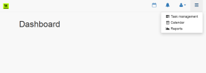

# Creating navigation with bootstrap

We were start from already prepared bootstrap theme [sample](http://ironsummitmedia.github.io/startbootstrap-sb-admin-2/pages/index.html) and we will try to take as much as possible out of it.

## Navigation

Navigation bar will be at the top of each application page and should be always visible. All shared elements which are on all pages,  are going to the [base layout](http://symfony.com/doc/current/book/templating.html), this is [base.html.twig](https://github.com/bisaga/Worklog/blob/master/src/Views/base.html.twig) in our application.

If you need some specific information about bootstrap you can probably found it on [this site.](http://www.w3schools.com/bootstrap/default.asp) [W3School.com](http://www.w3schools.com/) site is one of my primary sources for web and SQL related questions.

After some experimentation I create something like that:

Main navigation bar at the top is always visible even when we scroll down beyond visible space (navbar-fixed-top). This require little additional CSS settings that our pages on the top has some default margin.

## CSS

In our worklog.css we define default top margin as:

body {
    padding-top:65px;
}

Because we define "body" element as selector, this will be valid for every web page in our web site.

## Navigation tag with bootstrap  settings

One part of template looks like:

<body>
    

        <nav class="navbar navbar-default navbar-fixed-top" role="navigation">
            

                
            

            
    
                <ul class="nav navbar-top-links navbar-right">
                    <li>
                        <a href="{{app.request.basepath}}/index.php/workday">
                            <i class="fa fa-calendar-o fa-fw fa-lg"></i>
                        </a>
                    </li>

We create navigation bar with brand icon on the left and some icons with two direct links (calendar, alerts) and two drop-down menus for some additional actions.

You can download the [whole file](https://github.com/bisaga/Worklog/blob/master/src/Views/base.html.twig) from here.

## Controllers

Default page on the web site will be used as dashboard, so we create dashboard.html.twig template file and controller class in  [DashboardController.php](https://github.com/bisaga/Worklog/blob/master/src/Controller/DashboardController.php) . We also connect default '/' route to this controller (Application.php).

    private function createRoutes() 
    {
        $this->get('/', 'Bisaga\\Controller\\DashboardController::show');
       
    }

## Links

For links we use direct path navigation with little help of Silex Application constants, so links are assembled like this:

{{app.request.basepath}}/index.php/workday

In some point I will probably study [assetic component from Symfony](http://symfony.com/doc/current/cookbook/assetic/asset_management.html) but for now I will stick to this simplest semi-direct references.

## Icons

Icons are actually characters from the font [Font-Awesome](https://fortawesome.github.io/Font-Awesome/icons/). Images on the navigation bar are slightly larger (fa-lg) then those in drop-down menus.

<a href="{{app.request.basepath}}/index.php/workday">
    <i class="fa fa-calendar-o fa-fw fa-lg"></i>
</a>

You can learn more about font awesome usage [here](https://fortawesome.github.io/Font-Awesome/examples/).

This sample application is [published on github](https://github.com/bisaga/Worklog).
