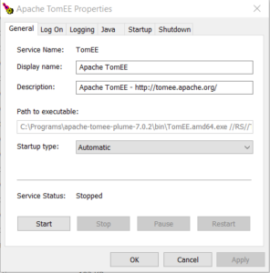
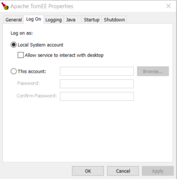
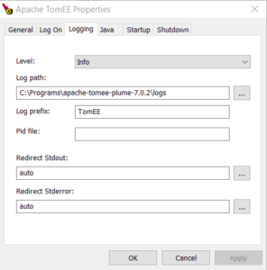
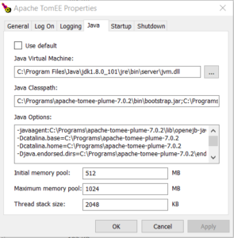
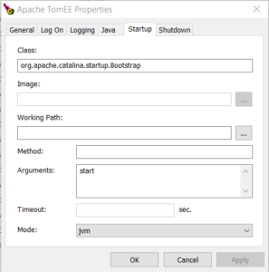
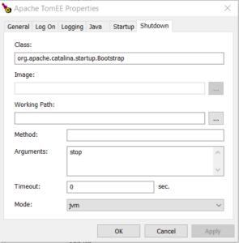
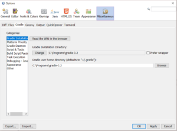
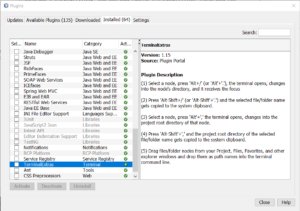

## Environment

My current environment consist of windows 10 on HP Pavillion i7 notebook with 8GB RAM, 2 x 500 GB SATA disk.

## Java

Install java JDK and set JAVA\_HOME and JRE\_HOME environment variables.

JAVA\_HOME = C:\\Program Files\\Java\\jdk1.8.0\_101
JRE\_HOME = %JAVA\_HOME%\\jre

## IDE: Netbeans 8.2

[Download](https://netbeans.org/downloads/) and install Netbeans for Java EE development. Netbeans IDE have very small font for menus and project browser etc. You can change size of  base font with parameters on netbeans program start :

"C:\\Program Files\\NetBeans 8.2\\bin\\netbeans64.exe" --fontsize 16

You can add this parameter in [etc\\netbeans.conf](http://netbeans.tusharjoshi.com/2008/05/netbeans-ide-default-font-size.html) file like this :

netbeans\_default\_options="<old-options> --fontsize 16"

### Netbeans plugins

#### [QuickOpener plugin](https://github.com/dzsessona/QuickOpener-NetBeans/wiki/Overview)

Open OS shell (windows command window) on the location of the selected file is important feature.

Open **/Tools/Plugins** and search and install QuickOpener plugin.

Select a file in a project tree and hit **Alt+1,** command window will open.

#### [Markdown](http://plugins.netbeans.org/plugin/50964/markdown-support)

Markdown is a text-to-HTML conversion tool for web writers. Markdown allows you to write using an easy-to-read, easy-to-write plain text format, then convert it to structurally valid XHTML (or HTML). This plugin is installed in Netbeans 8.2 as downloaded installation  "nbm" file and installed from there.

#### [NB MindMap](http://plugins.netbeans.org/plugin/60188/nb-mindmap-editor) Editor

The Plugin keeps information in formatted markdown compatible text files (\*.MMD) and show the information content as graphs. This plugin is installed from the netbeans plugin repository.

 

## Java EE Server: [Apache TomEE Plume](https://tomee.apache.org/) 7.0.2

Download and install TomEE Plume server, unzip to some folder, for example:

C:\\Programs\\apache-tomee-plume-7.0.2

and install as service (with a batch file command).

### Prepare tomcat\_users.xml file

Username and password are written in tomcat-users.xml file under conf folder.

    <role rolename="tomee-admin"/>
    <role rolename="manager-gui"/>
    <role rolename="manager-script"/>
    <user password="xxxxxxxxxxxxxxx" roles="manager-gui,manager-script,tomee-admin" username="igorb"/>
    <user password="admin123" roles="manager-gui,manager-script,tomee-admin,admin" username="admin"/>

### Install TomEE server as windows service

Run as administrator: **service.install.as.admin.bat**

After installation check all service settings with "tomee.exe" application. In **Java** tab you should have :

Java virtual machine:
C:\\Program Files\\Java\\jdk1.8.0\_101\\jre\\bin\\server\\jvm.dll

Java Classpath:
C:\\Programs\\apache-tomee-plume-7.0.2\\bin\\bootstrap.jar;C:\\Programs\\apache-tomee-plume-7.0.2\\bin\\tomcat-juli.jar;C:\\Programs\\apache-tomee-plume-7.0.2\\bin\\tomcat-juli.jar

Java Options:
-javaagent:C:\\Programs\\apache-tomee-plume-7.0.2\\lib\\openejb-javaagent.jar
-Dcatalina.base=C:\\Programs\\apache-tomee-plume-7.0.2
-Dcatalina.home=C:\\Programs\\apache-tomee-plume-7.0.2
-Djava.endorsed.dirs=C:\\Programs\\apache-tomee-plume-7.0.2\\endorsed
-Djava.io.tmpdir=C:\\Programs\\apache-tomee-plume-7.0.2\\temp
-Djava.util.logging.manager=org.apache.juli.ClassLoaderLogManager
-Djava.util.logging.config.file=C:\\Programs\\apache-tomee-plume-7.0.2\\conf\\logging.properties
-Djava.awt.headless=true
-XX:+UseParallelGC
-XX:MaxPermSize=256M

**Screen captures:**

     If service didn't want to start as service (windows/services), check log files and react accordingly.

### Correct IDE proxy setting in server properties

If TomEE server will not want to **start** or **stop** propertly **from inside Netbeans IDE** environment,  then you need to change proxy settings.

##### Go to: _Servers> (Apache Tomcat EE server)> plataform > "used ide proxy settings"_

**Uncheck "used ide proxy settings" !**

### Why use TomeEE Plume server ?

### Hot deployment !

TomEE is highly compatible with other JavaEE servers (JBoss, WildFly, etc.) but is simpler for development because of build in **hot deployment** support ! Immediately after changes in resources (java files, html files, javascript files ..etc.) there is no need to rerun and restart  server. Browser window opened in the debug mode (in chrome with netbeans extension) will refresh automatically.

You need to run application in **Debug mode** to be able to benefit from hot deploy and unfortunately not all changes in java files are allowed.

 

## WildFly/JBoss server for production

For production application server I will use [WildFly.](http://wildfly.org/downloads/) Download ZIP formated file (wildfly-10.1.0.Final.zip) and unzip it to some working folder where your standalone server wil run.  You can also download RedHat JBoss EAP product, it is essentially the same but with some additions.

It is a good idea to have one instance of production Java EE server installed to be able to test applications under production server.

### Setup chrome browser

For debugging you will need latest chrome browser.

**Add it to the PATH** Add folder of "chrome.exe" program to the environment variable  PATH (for example: "C:\\Program Files (x86)\\Google\\Chrome\\Application" ) You can check if chrome folder is already in the path with this windows power-shell command :

    PS C:\\> $env:PATH

## Debugging Java and JavaScript

When you run web application with "**Chrome with Netbeans Connector**" for the first time and you don't have connector installed, you will get dialog for installing chrome extension.  After selecting install options in the dialog, chrome will open and proper extension will be already prepared for installation. Just add extension to chrome and rerun web application under debug.

Program will now stop at any breakpoint in **java** or **javascript** files.

## Gradle build environment

Download binary distribution file of [gradle](https://gradle.org/gradle-download/) and unzip it to some folder (C:\\Programs\\gradle-3.2).

In the Netbeans go to Tools/Plugins and install gradle plugin.  After netbeans restart go to Tools/Options/Miscellaneous/Gradle in in Gradle Installation change gradle installation directory to local folder to where you install gradle before. Put same folder for gradle home directory to.

## 

## Flyway database migrations tool

Go to flyway web site and [download](https://flywaydb.org/getstarted/download) it. Unzip it to some location (C:\\Programs\\flyway-4.0.3), now you can config it directly in installed folder or do some extra work to [configure it locally inside your java project](http://bisaga.com/blog/programming/flyway-setup-inside-java-project/).

## Cygwin environment

If you are using windows, you will probably install [cygwin](https://cygwin.com/install.html).  After download and run installation program, just check under "Shell" group if you have bash shell selected. You can add additional packages, for example "bash command completion" package.

You can always add additional packages to an existing cygwin installation, just repeat installation procedure again.

**Additional packages**

All/Utils/**tree**: Display graphical directory tree

 

**Netbeans** will open bash terminal if you open Window/IDE Tools/Terminal window menu command.

Home folder for your locally installed cygwin will be at the location of environment variable "HOME".  Set this variable at desired location on your disk. Create "home" folder and subfolder with your user name.

create windows environment variable 
HOME=h:\\home\\igorb

Create additional 'bin' folder inside home folder and add it to the path.  You will be able to write automated bash scripts and put them there and use them as instantly accessible commands.

mkdir H:\\HOME\\igorb\\bin

add "%HOME%\\bin;" to windows PATH

#### No spaces in PATH variable

You should check PATH  environment variable in windows, cygwin doesn't convert path correctly if you put a **blank space between**  folders. Path will still work in windows, but not in cygwin !

For example the path in example will be converted as

PATH=C:\\WINDOWS\\;C:\\WINDOWS\\SYSTEM32;

$ echo $PATH
/cygdrive/c/WINDOWS:/cygdrive/c/WINDOWS/SYSTEM32

If any part of the path is not properly converted to **/cygdrive/** mappings, you will not be able to rely on the system path.

## Netbeans - TerminalExtras plugin

This plugin enable shortcut keys to change current folder in already open terminal in to the node's directory (with **Alt+.**)

To be able to change current folder with "Alt+." command you need to have:

- Opened local "Terminal" window
- selected node in the project tree (any node)
- press "Alt" and "dot" key
    
    igorb@Pavilion /cygdrive/c/Program Files/NetBeans 8.2
    $ cd "C:\\Users\\igorb\\Documents\\NetBeansProjects\\HelloWorld\\src\\java"
    
    After key command on the "Source Packages" projects node, "cd" command will be executed and focus will move to the terminal.
