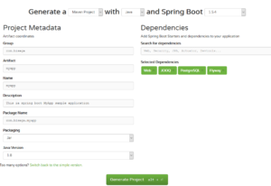
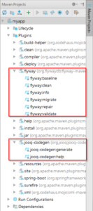
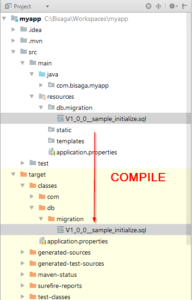
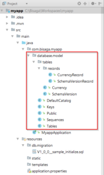
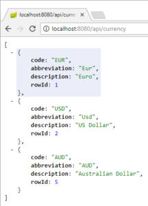
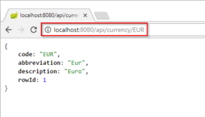
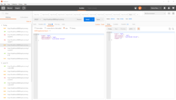

##### You can get [source code](https://github.com/bisaga/SpringBootMyApp) of this project from github repository "[SpringBootMyApp](https://github.com/bisaga/SpringBootMyApp)" .

# Create Spring Boot Maven project

Go to [Spring Boot project generator](https://start.spring.io/) web site and select minimal project definition with dependencies :

- **Web**:  dependency for embedded tomcat server
- **jOOQ**: integrated SQL query language and data model code generator
- **Flyway**: database model migration tool
- **Postgresql JDBC driver**

After downloading ZIP project file, unzip it to some folder and open folder in IntelliJ IDE environment.

## Startup class

The project will automatically include embedded tomcat server and spring application start will configure whole application at startup.

package com.bisaga.myapp;

import org.springframework.boot.SpringApplication;
import org.springframework.boot.autoconfigure.SpringBootApplication;

@SpringBootApplication(scanBasePackages = { "com.bisaga" })
public class MyappApplication {

	public static void main(String\[\] args) {
		SpringApplication.run(MyappApplication.class, args);
	}
}

#### Setup project properties

Under src/main/resources find file **application.properties** and add configuration for database access  and flyway configuration. Your application will start migration procedure at every application start and syncronize to the correct version automatically.

#Debug
debug=false

# Database connection
spring.datasource.driverClassName=org.postgresql.Driver
spring.datasource.url=jdbc:postgresql://localhost:5432/myappdb
spring.datasource.username=..........
spring.datasource.password=..........

# Jooq dialect
spring.jooq.sql-dialect=POSTGRES

# Flyway
flyway.locations=classpath:db/migration

#### Flyway migration files

You need a folder where your SQL migration files will reside:

src/main/resources/db/migration

Add first migration file, for example "create currency table" will be saved in file **V1\_0\_0\_\_**currency.sql:

/\*
 \* Currency
 \*/
CREATE TABLE currency (
	code 						VARCHAR(60) not null,
	abbreviation 				varchar(60),
	description 				text,
	row\_id 						serial primary key,					-- row identifier
	created\_at 					timestamptz not null default now(),
	created\_by 					varchar(60) not null,
	modified\_at 				timestamptz,
	modified\_by 				varchar(60)
);
CREATE INDEX currency\_created\_at ON currency (created\_at) ;
CREATE INDEX currency\_modified\_at ON currency (modified\_at) ;

-- DEMO DATA
INSERT INTO public.currency (code, abbreviation, description, created\_by)
VALUES('EUR', 'Eur', 'Euro', 'admin');

INSERT INTO public.currency (code, abbreviation, description, created\_by)
VALUES('USD', 'Usd', 'US Dollar', 'admin');

Be extra careful with names , first part (V1\_0\_0) is version of migration file, second part of the name is a description, separated with two underline characters.

The scripts must be correct SQL! Validate it first in database environment. If script is not valid, migration procedure will break and you will probably have hard time to figure out what was wrong.

Now you run your application and your database must be prepared according to migration script changes automatically. Flyway start automatically with your application.

More information on this [video tutorial](https://www.youtube.com/watch?v=5JUJHHc4KZc) for flyway and spring boot..

## Maven plugin settings

If you want more control around code generation and migration life cycle, you add flyway and jooq plugins:

Add this properties to the **properties section** in pom.xml file:

        <!-- Database -->
        <db.url>jdbc:postgresql://localhost:5432/myappdb</db.url>
        <db.username>........</db.username>
        <db.password>........</db.password>
        <!-- FlyWayDB -->
        <org.flywaydb.schema>public</org.flywaydb.schema>
        <org.flywaydb.location>classpath:db/migration</org.flywaydb.location>
        <org.flywaydb.version>4.2.0</org.flywaydb.version>
        <!-- jOOQ -->
        <org.jooq.codegen.namespace>com.bisaga.myapp.database.model</org.jooq.codegen.namespace>
        <org.jooq.input\_schema>public</org.jooq.input\_schema>
        <org.jooq.target\_dir>src/main/java/</org.jooq.target\_dir>
        <org.jooq.version>3.9.2</org.jooq.version>

- Database connection settings in pom.xml will be used by jooq code generator and flyway migration **maven plugins**.

#### Flyway and Jooq dependency and version

You probably already have it from generated pom.xml, add it if you don't have it.

        <dependency>
            <version>${org.flywaydb.version}</version>
            <groupId>org.flywaydb</groupId>
            <artifactId>flyway-core</artifactId>
        </dependency>
        <dependency>
            <groupId>org.jooq</groupId>
            <version>${org.jooq.version}</version>
            <artifactId>jooq</artifactId>
        </dependency>

Version was not required by spring boot but I put version in because I encounter differences between plugin version and spring boot version of the libraries.

**Now you need to define plugin definitions as** :

    <build>
        <plugins>
            <plugin>
                <groupId>org.springframework.boot</groupId>
                <artifactId>spring-boot-maven-plugin</artifactId>
            </plugin>

            <plugin>
                <groupId>org.flywaydb</groupId>
                <version>${org.flywaydb.version}</version>
                <artifactId>flyway-maven-plugin</artifactId>
                <!-- Note that we're executing the Flyway plugin in the "generate-sources" phase -->
                <executions>
                    <execution>
                        <phase>generate-sources</phase>
                        <goals>
                            <goal>migrate</goal>
                        </goals>
                    </execution>
                </executions>
                <!-- Note that we need to prefix the db/migration path with filesystem:
                    to prevent Flyway from looking for our migration scripts only on the classpath -->
                <configuration>
                    <url>${db.url}</url>
                    <user>${db.username}</user>
                    <password>${db.password}</password>
                    <locations>
                        <location>${org.flywaydb.location}</location>
                    </locations>
                    <schemas>${org.flywaydb.schema}</schemas>
                </configuration>
            </plugin>

            <plugin>
                <!-- Use org.jooq for the Open Source Edition org.jooq.pro for commercial
                    editions, org.jooq.pro-java-6 for commercial editions with Java 6 support,
                    org.jooq.trial for the free trial edition Note: Only the Open Source Edition
                    is hosted on Maven Central. Import the others manually from your distribution -->
                <groupId>org.jooq</groupId>
                <version>${org.jooq.version}</version>
                <artifactId>jooq-codegen-maven</artifactId>
                <!-- The jOOQ code generation plugin is also executed in the generate-sources phase,
                     prior to compilation -->
                <executions>
                    <execution>
                        <phase>generate-sources</phase>
                        <goals>
                            <goal>generate</goal>
                        </goals>
                    </execution>
                </executions>

                <!-- This is a minimal working configuration. See the manual's section about the code generator
                     for more details -->
                <configuration>
                    <jdbc>
                        <url>${db.url}</url>
                        <user>${db.username}</user>
                        <password>${db.password}</password>
                    </jdbc>
                    <generator>
                        <database>
                            <includes>.\*</includes>
                            <inputSchema>${org.jooq.input\_schema}</inputSchema>
                        </database>
                        <target>
                            <packageName>${org.jooq.codegen.namespace}</packageName>
                            <directory>${org.jooq.target\_dir}</directory>
                        </target>
                    </generator>
                </configuration>
            </plugin>
        </plugins>
    </build>

## Flyway and Jooq maven commands

After you add plugin definitions to maven pom.xml file you get new lifecycle commands :

When flyway commands are used directly they search for SQL files **in the target "classes" folder** and not in the source tree ("src"). When project compiled the files, target folder is synchronized with the current version of code in the source tree.

After compiling project you could run "flyway:migrate" command for example. You can always check files in the target folder and delete it if you are not sure you have the latest version of the files.

## Jooq code generation

Jooq generate data model code from your database. The code is added to the project in the namespace as you defined in plugin definition.  It's wise to split plugin definition to properties and plugin definition part.

<!-- jOOQ -->
<org.jooq.input\_schema>public</org.jooq.input\_schema>
<org.jooq.codegen.namespace>com.bisaga.myapp.database.model</org.jooq.codegen.namespace>
<org.jooq.target\_dir>src/main/java/</org.jooq.target\_dir>

Every time you compile project, database model code is regenerated. Check [here](https://www.jooq.org/) for more information about [jooq](https://www.jooq.org/).

You can check how database model code is regenerated simply by deleting a line from one of generated files and recompile the project again.

More about jooq & spring boot can be found [here](https://www.javacodegeeks.com/2016/03/springboot-working-jooq.html).

# Create JSON service

Now I need to test the environment if everything is set in place as should be. I will create simple currency service as sample application and test basic CRUD operations.

## Create simple data container class

To be able to send JSON payload back and forth from client to server we create a simple transport class:

package com.bisaga.myapp;

/\*\*
 \* Created by igorb on 17. 06. 2017.
 \*/
public class CurrencyDto {
    private String code;
    private String abbreviation;
    private String description;
    private Integer rowId;

    public String getCode() {
        return code;
    }

    public void setCode(String code) {
        this.code = code;
    }

    public String getAbbreviation() {
        return abbreviation;
    }

    public void setAbbreviation(String abbreviation) {
        this.abbreviation = abbreviation;
    }

    public String getDescription() {
        return description;
    }

    public void setDescription(String description) {
        this.description = description;
    }

    public Integer getRowId() {
        return rowId;
    }

    public void setRowId(Integer rowId) {
        this.rowId = rowId;
    }
}

## Service class and database interaction with Jooq

Now we create service class with which we will interact with database :

/\*
\*  MIT License
\*  Copyright (c) 2017 Igor Babic
\*/
package com.bisaga.myapp;

import static com.bisaga.myapp.database.model.tables.Currency.CURRENCY;

import com.bisaga.myapp.database.model.tables.records.CurrencyRecord;
import org.jooq.DSLContext;
import org.slf4j.Logger;
import org.slf4j.LoggerFactory;
import org.springframework.beans.factory.annotation.Autowired;
import org.springframework.stereotype.Service;
import org.springframework.transaction.annotation.Transactional;

import java.util.List;

@Service
@Transactional
class CurrencyService {
    private static final Logger LOG = LoggerFactory.getLogger(CurrencyService.class);

    @Autowired
    private DSLContext db;

    /\*\*
     \* List all currencies in the currency table
     \* @return Return list of currency records
     \*/
    List<CurrencyDto> getAll() {
        List<CurrencyDto> currList;
        currList = db.select().from(CURRENCY)
                .fetch().into(CurrencyDto.class);

        return currList;
    }

    /\*\*
     \* Search for a currency record by currency code
     \* @param code  currency code as parameter
     \* @return Return currency record
     \*/
    CurrencyDto getByCode(String code) {
        List<CurrencyDto> currList;
        currList = db.select().from(CURRENCY)
                .where(CURRENCY.CODE.eq(code))
                .fetch().into(CurrencyDto.class);
        
        return currList.get(0);
    }

    /\*\*
     \* Delete currency record by row identifier
     \* @param rowId rowId row identifier
     \* @return Return number of deleted records
     \*/
    Integer delete(Integer rowId) {
        return db.delete(CURRENCY).where(CURRENCY.ROW\_ID.eq(rowId)).execute();
    }

    /\*\*
     \* Save currency execute insert or update command if currency already exist.
     \* @param currency instance of CurrencyDto class as parameter
     \*/
    CurrencyDto saveCurrency(CurrencyDto currency) {
        if (currency.getRowId() == null) {
            return this.insert(currency);
        } else {
            return this.update(currency);
        }
    }

    /\*\*
     \* Insert new currency record to database
     \* @param currency Currency record as parameter
     \* @return Return currency record filled with database defaults after insert
     \*/
    private CurrencyDto  insert(CurrencyDto currency)  {
        CurrencyRecord record = db.newRecord(CURRENCY, currency);
        record.setCreatedBy("admin");
        record.insert();                // insert to database
        record.into(currency);			// return changes made by database
        return currency;
    }

    /\*\*
     \* Update currency record in database
     \* @param currency currency record as parameter
     \* @return Return currency record filled with changes from database update
     \*/
    private CurrencyDto update(CurrencyDto currency) {
        CurrencyRecord record = db.newRecord(CURRENCY, currency);
        record.update();                // update to database
        record.into(currency);			// return changes made by database
        return currency;
    }

}

## REST controller with router mapping

On the end we need a controller class to expose access points for REST service:

/\*
\*  MIT License
\*  Copyright (c) 2017 Igor Babic
\*/
package com.bisaga.myapp;

import org.springframework.beans.factory.annotation.Autowired;
import org.springframework.http.HttpStatus;
import org.springframework.web.bind.annotation.\*;

import java.net.Authenticator;
import java.util.List;

@RestController
@RequestMapping(value = "/api/currency", produces = "application/json")
public class CurrencyController {

    @Autowired private CurrencyService service;

    @RequestMapping(method=RequestMethod.GET)
    @ResponseStatus(HttpStatus.FOUND)
    public List<CurrencyDto> findAll() {
        return service.getAll();
    }

    @RequestMapping(value="/{code}", method=RequestMethod.GET)
    @ResponseStatus(HttpStatus.FOUND)
    public CurrencyDto findByCode(@PathVariable("code") String code) {
        return service.getByCode(code);
    }

    @RequestMapping(method=RequestMethod.POST)
    @ResponseStatus(HttpStatus.OK)
    public CurrencyDto saveCurrency(@RequestBody CurrencyDto currency) {
        return service.saveCurrency(currency);
    }

    @RequestMapping(method=RequestMethod.DELETE)
    @ResponseStatus(HttpStatus.OK)
    public Integer deleteCurrency(@RequestParam(value = "rowid", required = true) Integer rowId ) {
        return service.delete(rowId);
    }

}

Don't forget to instantiate services with DI (dependency injection) with @Autowire annotation. This simplify development a lot !

## Interactive testing

The service should in this point work as expected, just run application and navigate to "localhost:8080/api/currency".

You can search for a specific currency with added path variable appended to Url address:

## Postman application for Http API testing

To inspect service in more details on the client side, you can use [Postman](https://www.getpostman.com/postman) application.

Look at example ofadding a currency with a **POST** message:

In the headar I add "content-type" variable with value "application/json" and in the payload a json message with a new currency json structure. On the right side I received "200-OK" and a currency record with a record and new row identifier registered in the database.
