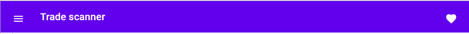

### AspNet Core - Server side Blazor framework

Source: [https://www.matblazor.com/](https://www.matblazor.com/)

If you need open source components for Blazor you definitively need to look at MatBlazor component library.

#### Installation

- MatBlazor nuget library
- EmbeddedBlazorContent nuget library (for server side blazor projects)

#### Startup.cs

**Configure** method

// Embedded blazor content get static content from depended DLLs 
app.UseEmbeddedBlazorContent(typeof(MatBlazor.BaseMatComponent).Assembly);

#### \_Imports.razor

Add additional "using" statement for MatBlazor

@using MatBlazor

#### \_Host.cshtml

@addTagHelper \*, MatBlazor
@using EmbeddedBlazorContent

<head>
    <!-- static resources from dependent blazor libraries -->
    @Html.EmbeddedBlazorContent()
</head>

#### Application bar sample

In the NavMenu.razor file add:

<MatAppBarContainer>
    <MatAppBar Fixed="true">
        <MatAppBarRow>
            <MatAppBarSection>
                <MatIconButton Icon="menu"></MatIconButton>
                <MatAppBarTitle>Trade scanner</MatAppBarTitle>
            </MatAppBarSection>
            <MatAppBarSection Align="@MatAppBarSectionAlign.End">
                <MatIconButton Icon="favorite"></MatIconButton>
            </MatAppBarSection>
        </MatAppBarRow>
    </MatAppBar>   
</MatAppBarContainer>

**After compile your application should look something like :**

Blazor components are encoded without namespaces, it means **@addTagHelper** and **@using** statements are in place and working.
