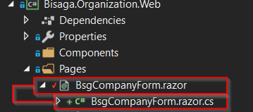

Correct way is to create ASP.NET Core Web Application and in the second step select "Razor Class Library" project template.

If you create Standard or AspNet.Core library directly then your project file will not contain correct setup for razor component source generation, but you can easily correct this manually:

#### The correct .csproj file structure of razor library project

<Project Sdk="Microsoft.NET.Sdk.Razor">

  <PropertyGroup>
    <TargetFramework>netcoreapp3.0</TargetFramework>
    <AddRazorSupportForMvc>true</AddRazorSupportForMvc>
  </PropertyGroup>

  <ItemGroup>
    <FrameworkReference Include="Microsoft.AspNetCore.App" />
  </ItemGroup>

</Project>

 

#### \_Imports.razor file

Imports razor file can contain any number of statements (usually centralized **using** statements). The file will be automatically included in all razor component files in the folder and all subfolders of imports file.

@using MatBlazor
@using Bisaga.Organization.Web.Pages;

### Razor files and coresponding code behind file naming convension

If we want to have "code behind" files (with csharp code) hidden "**under**" the razor file (in Visual Studio) then you need to name components with the same name and additional suffix ".cs".

**Example:**

The name of the component "BsgCompanyForm.razor" and the code behind with "functions" in csharp file named "BsgCompanyForm.razor.cs". But don't forget that the name of the class cannot be the same as the component name (in this case "BsgCompanyForm" but we usually add some additional suffix in the class name too.

Both files are then connected with the **@inherits** statement

#### BsgCompanyForm.razor file:

@inherits BsgCompanyFormBase

<h1>Company</h1>

#### BsgCompanyForm.razor.cs file:

using Bisaga.Framework.Web;
using System;
using System.Collections.Generic;
using System.Text;

namespace Bisaga.Organization.Web.Pages
{
    public class BsgCompanyFormBase : BsgPageBase
    {
    }
}

If you need to include **additional resources** (as javascript, CSS) to the project for the final web project deployment, use **EmbeddedBlazorContent library**: [http://bisaga.com/blog/programming/embeddedblazorcontent-how-to-include-static-content-from-blazor-libraries/](http://bisaga.com/blog/programming/embeddedblazorcontent-how-to-include-static-content-from-blazor-libraries/)
