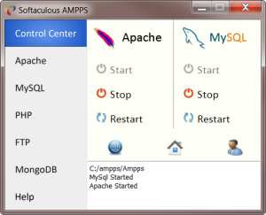
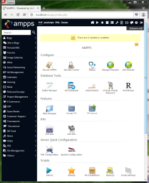
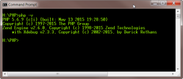
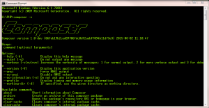
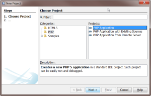
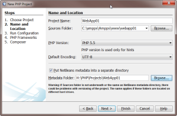
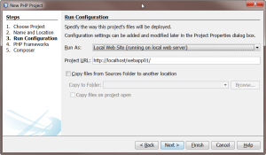
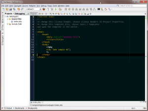
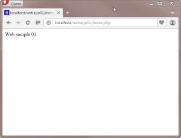
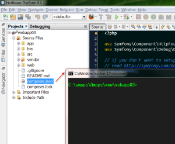

If you are running Windows 7, you will need to install a few things before you can start with development in php.

### **Web server** 

For start, we need some sort of web server to serve PHP web pages.

I select [Softaculous Ampps](http://www.ampps.com/) server, because it is simple to install and has tons of open source applications prepared to installation.

Here is  more information about how to [install Ampps](http://www.ampps.com/wiki/Install) on windows.

If you already have **any other server/service on port 80** (like IIS for example), this will interfere with default configuration of your new Ampps server. The best solution is to stop critical service, reconfigure it to another port or uninstall it, before you install Ampps.

After successful installation, you start server and with little luck, you will see next screen:

Navigate to http://localhost/ampps and you will get administration interface:

### PHP and command line support

Just add  php.exe program to [PATH environment variable](http://www.computerhope.com/issues/ch000549.htm).  PHP is located in C:\\ampps\\Ampps\\php folder inside your server installation directory.

Check php version:

H:\\PHP>php -v

### Composer

[Composer](https://getcomposer.org) is dependency manager for PHP, you will need it for libraries installation later on.  Don't forget to add composer **ComposerSetup\\bin** folder to the environment PATH, you will use it from command line. Composer is batch file on windows (composer.bat),  so you can run it like a program from command line.

Check composer version:

H:\\PHP>composer -v

 

### Netbeans IDE

There is a lot of choice in selection of best PHP IDE. If you looking for decent intellisense support, good debugging support and you want it for free,  [Netbeans](https://netbeans.org/downloads/) is one of the best out there.

Just install "HTML5 & PHP only" edition, you will get smaller and faster IDE.  After installation, try to  deactivate plugins you are not using, to speed up startup time even more.

#### Create first project

Open Netbeans IDE add new project (File/New project) :

Put your new project directly to local web server folder (C:\\ampps\\Ampps\\www\\**project\_folder**) and put netbeans specific metadata (project management) files to separate directory. This way, your code in web server, will stay clean and ready to upload to hosting server.

In this step, you select deployment method. Actually, there is no deployment at all, we run project directly from local web server.

Other options are not required , so we finish  project creation procedure.

Put some code inside php tag in index.php file, for example something like that:

<?php
echo 'Web sample 01'; 
?>

Now you run application, from Netbeans with  **run command** or navigate to application URL address in browser.

http://localhost/webapp01/index.php

And result of this first simple application in browser is :

### Netbeans plugins - [QuickOpener](https://github.com/dzsessona/QuickOpener-NetBeans/wiki/Overview)

The most important feature for me is ability to open OS shell (DOS command window) on the location of the selected file. Select a file in project tree inside netbeans and  hit **Alt+1**.

Not to rely too much on IDE is important to me. Many features in web development require command line interface and easy access to command line, directly from the project tree, is very important.
