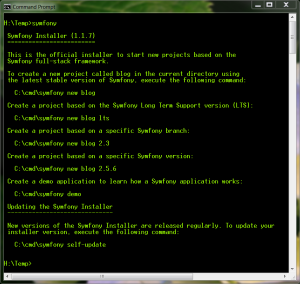
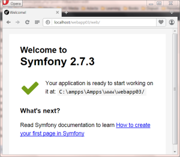
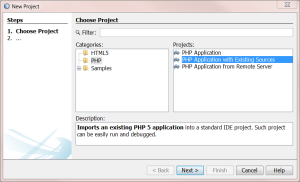
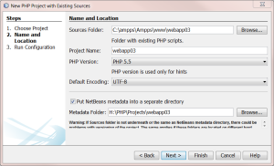
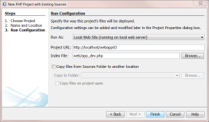

#### Symfony installer

[Symfony](https://symfony.com/) is one of the best php frameworks for web development. To start working with symfony we first need to download [symfony installer:](http://symfony.com/doc/current/book/installation.html)

c:\\> php -r "readfile('http://symfony.com/installer');" > symfony

After downloading symfony file, you can copy it to your new projects folder.

Then you use it with php interpreter as a command:

C:\\> php symfony

If you wish to simplify usage of symfony command,  just create dos batch command file (symfony.bat) with next content:

@echo off
call php C:\\cmd\\symfony %\*

Save both files, downloaded symfony file and batch file to a system wide available folder. If you haven't it yet, create one folder (like C:\\cmd) and add it to [system environment PATH](http://www.computerhope.com/issues/ch000549.htm).  New command "symfony" will then be available anywhere on the system. To check it, open DOS command window and type symfony command:

H:\\TEMP> symfony

You should see something like this:

Symfony **installer** installed !

#### Create first project

To create new symfony project, open DOS command line in projects parent folder and enter command :

C:\\ampps\\Ampps\\www\\>symfony new webapp03

As I described in [this blog article](http://bisaga.com/blog/programming/php-development-environment-on-windows/), my development environment consist of locally installed apache web server. This means I don't need to start web server every time I want to serve application manually, but AMPPS application must be started of course.

To open newly created application, enter URL of the project into the browser:

http://localhost/webapp03/web/

You will get application default startup page like:

#### Create project in Netbeans with existing source

If you now want to work in [Netbeans](https://netbeans.org/features/php/), just open new project with existing source:

 

Select folder where generated project reside and you are good to go. You can create extra meta data folder for netbeans specific project files. This way you will not to pollute  web folder itself.

On the last step you should define startup file , this could be **web/app.php** or **web/app\_dev.php,** with some additional development informations from symfony framework in the bottom of the web page.

