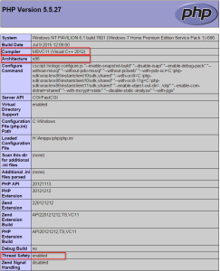
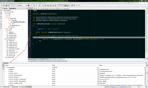

Please read great article about [installation and configuration debugging for PHP in Ampps server](http://www.ampps.com/blog/how-tos/installing-xdebug-for-all-php-versions-in-ampps-for-windows-1273.html).

I just want to add some additional tips before you start downloading and installing files...

##### Determine you visual C runtime, architecture and thread safety

Open [Ampps local control center](http://localhost/ampps/) and check [PHP Info](http://localhost/cgi-bin/phpinfo.cgi) page.

Files are named with combination of **used compiler** (MSVC11 = VC11, MSVC9 = VC9), **architecture** (x86 = 32bit,  x64 = 64bit) and **thread safety** settings (TS = enabled).

With this information you should select proper [DLL for download](http://xdebug.org/download.php).

After downloading DLL file for your selected PHP configuration, you must copy file to "php/ext" folder and add  new config setting to php.ini file :

zend\_extension="\\php\_xdebug.dll"

For debuging to work from Netbeans, you need to add this xdebug settings to php.ini file:

xdebug.remote\_enable=1
xdebug.remote\_host=127.0.0.1
xdebug.remote\_port=9000
; Port number must match debugger port number in 
; NetBeans IDE Tools > Options > PHP
xdebug.remote\_handler=dbgp

Restart Apache and check phpInfo() in local ampps web admin page (http://localhost/ampps/).

After successful installation your breakpoints in [PHP code should work as expected](https://netbeans.org/kb/docs/php/debugging.html).

When you debug application, link to the application, get additional debug parameter:

http://localhost/webapp03/web/app\_dev.php?XDEBUG\_SESSION\_START=netbeans-xdebug
