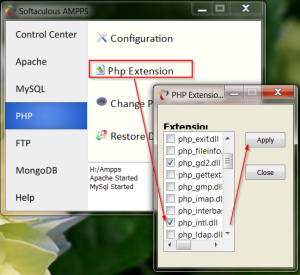
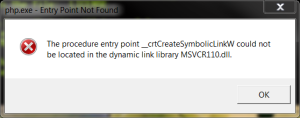

# Enabling php\_intl extension

If you need internationalization extension (php\_intl.dll), and you have [similar development environment](http://bisaga.com/blog/programming/php-development-environment-on-windows/) as I have, then follow this steps:

Open Ampps manager under PHP , enable internationalization extension (php\_intl.dll) and click Apply.

#### That was simple , yes ?

To check if extension is available, you need to start "php -i" in command line and search for "intl" :

H:\\>php -i

#### Well, I got this error:

_The procedure entry point \_\_crtCreateSymbolicLinkW could not be located in the dynamic link library MSVCR110.dll_

We need latest [Visual C++ Runtime](http://www.microsoft.com/en-us/download/details.aspx?id=30679), but even if we have one on the windows installed, something prevent PHP to load correct DLL.

After a while and lot of experimenting I figure out that MSVCR110.dll is installed in PHP folder as part of Ampps installation (H:\\Ampps\\php folder for me). Windows will load this local DLL from folder where program started and will not search for one on the system.

I just rename dll file to something else ("not\_used\_MSVCR110.dll") and check again. This time "php -i" was executed without errors and I found "intl" settings in generated output .

intl

Internationalization support => enabled
version => 1.1.0
ICU version => 51.2
ICU Data version => 51.2

There is one more location where MSVCR110.dll is installed (H:\\Ampps\\apache\\bin). This is obviously inside apache runtime system and I renamed that too.

I am not sure if this is the best way to solve this problem, but for now I am satisfied.
