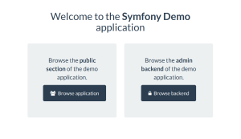

# Install [demo application](http://symfony.com/blog/introducing-the-symfony-demo-application)

Symfony provide [demo application](http://symfony.com/blog/introducing-the-symfony-demo-application) as a learning resource.  To install it just enter "demo" as parameter to "symfony" command.

H:\\Ampps\\www>symfony demo

## Start demo application

To start newly installed app, navigate to:

http://localhost/symfony\_demo/web/app\_dev.php

First page of application :

If demo application doesn't work as expected and you get error like this :

An exception has been thrown during the rendering of a template ("The Symfony\\Component\\Intl\\DateFormatter\\IntlDateFormatter::\_\_construct() method's argument $locale value NULL behavior is not implemented.  Only the locale "en" is supported. Please install the "intl" extension for full localization capabilities.") in blog/post\_show.html.twig at line 35.

Just repair one line of php code in "IntlDateFormatter.php" file, as described in details in this [fix](https://github.com/symfony/Intl/commit/4c2983fb9e1ba9a7fbd5940cbab91ee93971bd0e) .

File is placed inside demo app source tree , in my case this is:

H:\\Ampps\\www\\symfony\_demo\\vendor\\symfony\\symfony\\src\\Symfony\\Component\\Intl\\DateFormatter\\IntlDateFormatter.php

Open file and change first "if" statement in "\_\_constructor" method to reflect second line :

\- if ('en' != $locale) {
+        if ('en' !== $locale && null !== $locale) {

Save file and navigate to application again, this time should work as expected.
