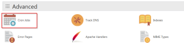
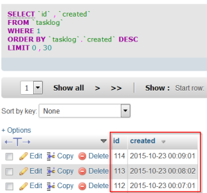

# Background jobs

If you wish to write responsive web applications, you will need to  push some operations in the background. That way you can just register request for some long running task and immediately return to the client.

If you search the web, there are many ways how to achieve this, but not so many implementation are ready to do it in constraint environment of simple web hosting.

My web page is hosted by [GoDaddy](https://www.godaddy.com/?plid=GoDaddy) with so called "Linux hosting with cPanel". I have [PHP](https://secure.php.net/) and [MySql](https://www.mysql.com/), but not much beside this. GoDaddy luckily allows [cron jobs](https://www.godaddy.com/help/create-cron-jobs-3548).  We simply register some command as "cron job" to run unattended at specified frequency.

For proof of concept I will need simple php program and run it as cron job.  At each cron job iteration we will insert one record into database table. We just want to proof that php program can run in the background as  cron job.

Create some database and add "tasklog" table.

create table tasklog (
    id int not null auto\_increment,
    created datetime,
    primary key (id)
)

Our simple PHP program is :

<?php
try {
    $host = "localhost";
    $dbname = "your\_database";
    $user = "your\_db\_user";
    $pass = "your\_password";

    # MySQL with PDO\_MYSQL
    $db = new PDO("mysql:host=$host;dbname=$dbname", $user, $pass);
    $db->setAttribute( PDO::ATTR\_ERRMODE, PDO::ERRMODE\_EXCEPTION );

    $stmt = $db->prepare("INSERT INTO tasklog(\`created\`) VALUES(NOW())");
    $stmt->execute();
  
    $db = null;
}
catch(PDOException $e) {
    echo $e->getMessage();
}

To test it, just put the "taskrun.php" in your "public\_html" folder and navigate to it. If something will go wrong in the program, the settings for exceptions are set to report it to the client. Please test the program until everything not running smoothly.

### Register [cron job](https://www.godaddy.com/help/create-cron-jobs-3548)

You can put program file to any folder. If folder is not under "public\_html" folder, it will be inaccessible from the public web and that way will be much more secure. We create new "jobs" folder under our root home folder and move "taskrun.php" program there.

In the "cPanel" locate "Advanced" section and select "Cron Jobs":

Create new job with a one minute frequency as:

/usr/local/bin/php "$HOME/jobs/taskrun.php" > /dev/null 2>&1

To prevent email to be sent for each iteration, we put redirection into the command ( **> /dev/null 2>&1** ).

Wait a minute and check if there are some records in the "tasklog" table. You will see something like this:

Success !

Of course, this is only proof of concept for running something unattended in the background. But I think there are already some open source job-task runner out there.
