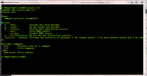

# Adding console support to [Silex](http://silex.sensiolabs.org/) application

Silex is a micro-framework and as such doesn't force you to use so many components included in full stack symfony framework. But, if we want to use some of them we need to do some extra work.

## [Install console component](http://symfony.com/doc/current/components/console/introduction.html)

Installing with composer is simple, just add additional requirements for "symfony/console"  to composer.json file. The full content of my composer.json file as currently is :

{
    "name": "igor.babic/bisaga",
    "description": "Sample silex application",
    "license": "MIT",
    "type": "project",
    "require": {
        "php": ">=5.5.9",
        "silex/silex": "~1.3",
        "doctrine/dbal": "~2.2",
        "twig/twig": "^1.23",
        "symfony/twig-bridge": "^2.7",
        "symfony/console": "^2.7",
        "doctrine/migrations": "^1.1"     
    },
    "autoload": {
        "psr-4" : {
            "Bisaga\\\\" : "src/"
        }
    }
}

After changing composer.json file just don't forget to execute update command.

H:\\Ampps\\www\\silex03>composer update

This way all required components for console support are installed. We can always check "vendor" folder after update, there will be everything required by composer definitions.

## Creating main console program

To be able to use "console" command, we need console.php program first. We have very easy job here, because everything is already written, we just need to get it from [symfony site](http://symfony.com/doc/current/components/console/introduction.html) .

We create console.php file with following content:

<?php
require \_\_DIR\_\_.'/vendor/autoload.php';

use Bisaga\\Infrastructure\\Console\\GreetCommand;
use Symfony\\Component\\Console\\Application;

$application = new Application();
$application->add(new GreetCommand());
$application->run();

As you can see, we already initialized one sample command here, "GreetCommand", we need to create the command too.

## Creating sample command in php

My silex application is as simple as it can be. The best in using micro-framework is that there is no forced structure from framework. We can create our own folder structure, so my is something like that:

[![2015-11-15 20_22_50-Programmer's Notepad - [console]](images/2015-11-15-20_22_50-Programmers-Notepad-console-172x300.png)](http://bisaga.com/blog/wp-content/uploads/2015/11/2015-11-15-20_22_50-Programmers-Notepad-console.png)

My  folder structure is not yet complete, it will evolve as application grows.

We place GreetCommand.php file from [symfony web guide](http://symfony.com/doc/current/components/console/introduction.html) to our Infrastructure \\ Console folder and change namespace to reflect our folder structure.

<?php

namespace Bisaga\\Infrastructure\\Console;

use Symfony\\Component\\Console\\Command\\Command;
use Symfony\\Component\\Console\\Input\\InputArgument;
use Symfony\\Component\\Console\\Input\\InputInterface;
use Symfony\\Component\\Console\\Input\\InputOption;
use Symfony\\Component\\Console\\Output\\OutputInterface;

class GreetCommand extends Command
{
    protected function configure()
    {
        $this
            ->setName('demo:greet')
            ->setDescription('Greet someone')
            ->addArgument(
                'name',
                InputArgument::OPTIONAL,
                'Who do you want to greet?'
            )
            ->addOption(
               'yell',
               null,
               InputOption::VALUE\_NONE,
               'If set, the task will yell in uppercase letters'
            )
        ;
    }

    protected function execute(InputInterface $input, OutputInterface $output)
    {
        $name = $input->getArgument('name');
        if ($name) {
            $text = 'Hello '.$name;
        } else {
            $text = 'Hello';
        }

        if ($input->getOption('yell')) {
            $text = strtoupper($text);
        }

        $output->writeln($text);
    }
}

Now we can test new command line program simply by calling console.php program with demo:greet parameter:

H:\\Ampps\\www\\silex03>php console.php demo:greet

We put console.php file directly to the root folder of our application, so we call console command from that folder.

If you wish to simplify call to the console.php program, you can write simple  batch program and put it somewhere in the system path:

@ECHO OFF
ECHO Command: php console.php %\*
call php %cd\\%console.php %\*

Now, you can call any console command as :

H:\\Ampps\\www\\silex03>console demo:greet
Command: php console.php demo:greet
Hello

For checking which commands are already initialized in the application, we execute "list" command:

H:\\Ampps\\www\\silex03>console list

That's it !

We are ready to add any commands to our silex application !
