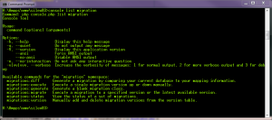
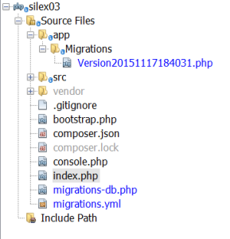

# Add Doctrine data migrations to [Silex](http://silex.sensiolabs.org/) application

There are quite a few blog articles about using doctrine migrations in different project types and [this article was closest](http://akrabat.com/using-doctrine-migrations-outside-of-doctrine-orm-or-symfony/) to what we need in Silex project.

## Install [doctrine migration](http://docs.doctrine-project.org/projects/doctrine-migrations/en/latest/reference/introduction.html) module

We add a few required components to composer.json and execute update command.

     "doctrine/dbal": "~2.2",
     "symfony/console": "^2.7",
     "doctrine/migrations": "^1.1"

We need to have symfony/console module already installed and prepared for extending with new commands, as I wrote in [this article](http://bisaga.com/blog/programming/adding-console-support-to-silex/).

Add migration commands to console.php program.  You can find them in vendor folder under:  "/lib/Doctrine/DBAL/Migrations/Tools/Console/Command" path.

<?php
// application.php

require \_\_DIR\_\_.'/vendor/autoload.php';

use Symfony\\Component\\Console\\Application;

$application = new Application();

//Migrations commands 
$application->add(new \\Doctrine\\DBAL\\Migrations\\Tools\\Console\\Command\\DiffCommand());
$application->add(new \\Doctrine\\DBAL\\Migrations\\Tools\\Console\\Command\\ExecuteCommand());
$application->add(new \\Doctrine\\DBAL\\Migrations\\Tools\\Console\\Command\\GenerateCommand());
$application->add(new \\Doctrine\\DBAL\\Migrations\\Tools\\Console\\Command\\MigrateCommand());
$application->add(new \\Doctrine\\DBAL\\Migrations\\Tools\\Console\\Command\\StatusCommand());
$application->add(new \\Doctrine\\DBAL\\Migrations\\Tools\\Console\\Command\\VersionCommand());

$application->run();

Add migrations configuration files:

Migrations [configuration](http://docs.doctrine-project.org/projects/doctrine-migrations/en/latest/reference/introduction.html) define base settings for migration generation and execution environment.

name: Doctrine Migrations
migrations\_namespace: Bisaga\\Migrations
table\_name: doctrine\_migration\_versions
migrations\_directory: ./app/Migrations

Database configuration is needed that migrations can really do the job.

<?php
return array(
        'host'      => 'localhost',
        'port'      => '3306',
        'driver'    => 'pdo\_mysql',
        'charset'   => 'utf8mb4',
        'dbname'    => 'bisagasamples',
        'user'      => 'dbuser',
        'password'  => 'dbpassword',
        'defaultTableOptions' => \[ 'charset'=> 'utf8mb4', 'collate' => 'utf8mb4\_slovenian\_ci'\],
);

## Default table options

How to set default create options for tables and columns such as default collation sequence and character set ?

###### 'defaultTableOptions' => \[ 'charset'=> 'utf8mb4', 'collate' => 'utf8mb4\_slovenian\_ci' \],

To set custom character set and collation just add "defaultTableOptions" array with your specific  default settings in connection configuration array (file: migrations-db.php).

## Console command interface

You can test it immediately with console command:

\>php console.php list migration

With data migrations you can easily update your project database with a programmatic interface with version support.  Your database schema can grow without risk of loosing control over it.

## Sample script

Empty class is generated with "migrations:generate" command. After initial generation you code migration changes manually.

<?php

namespace Bisaga\\Migrations;

use Doctrine\\DBAL\\Migrations\\AbstractMigration;
use Doctrine\\DBAL\\Schema\\Schema;

/\*\*
 \* Auto-generated Migration: Please modify to your needs!
 \*/
class Version20151117184031 extends AbstractMigration
{
    /\*\*
     \* @param Schema $schema
     \*/
    public function up(Schema $schema)
    {
        
        $worklogtable = $schema->createTable('worklogtable');
        
        $worklogtable->addColumn('id', 'integer', \['unsigned' => true, 'autoincrement'=>true\]);
        $worklogtable->addColumn('workdate', 'date', \['notnull'=>true\]);
        $worklogtable->addColumn('location', 'string', \['length' => 60\]);
        $worklogtable->addColumn('milage', 'decimal', \['precision' => 8, 'scale'=>2\]);
        $worklogtable->addColumn('starttime', 'time');
        $worklogtable->addColumn('endtime','time');
        $worklogtable->addColumn('totaltime','time');
        $worklogtable->addColumn('status', 'string', \['length' => 30\]);
        $worklogtable->setPrimaryKey(\['id'\]);        
        
        
        // 
        $worklogline = $schema->createTable('worklogline');
        
        $worklogline->addColumn('id', 'integer', \['unsigned' => true, 'autoincrement'=>true\]);
        $worklogline->addColumn('fromtime', 'time');
        $worklogline->addColumn('totime', 'time');
        $worklogline->addColumn('logtime', 'time');
        $worklogline->addColumn('description', 'string', \['length' => 250\]);
        $worklogline->addColumn('taskcode', 'string', \['length' => 150\]);
        $worklogline->addColumn('worklogid', 'integer', \['unsigned'=>true\]);
        $worklogline->setPrimaryKey(\['id'\]);                
        $worklogline->addForeignKeyConstraint($worklogtable, array('worklogid'), 
                        array('id'), array('onUpdate'=>'CASCADE', 'onDelete'=>'CASCADE'));
        
    }

    /\*\*
     \* @param Schema $schema
     \*/
    public function down(Schema $schema)
    {
        // this down() migration is auto-generated, please modify it to your needs
        $schema->dropTable('worklogline');
        $schema->dropTable('worklogtable');
    }
}

After generating first migration file the file is saved in configured migrations folder (./app/Migrations/).

## Run migrations

Your migration scripts will not running automatically, you need to do it by yourself.  To execute open migrations you need to run command:  "migrations:migrate" .

\>console migrations:migrate
