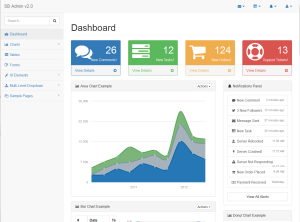
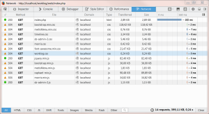

# Integrating Start Bootstrap template


We will implement bootstrap based web application theme in Silex application. The best way to start out is with already [available theme](http://startbootstrap.com/template-overviews/sb-admin-2/).

To install it into our application just execute bower install command in application web folder:

H:\\Ampps\\www\\worklog\\web>bower install startbootstrap-sb-admin-2

After installation of all required components (including jquery, bootstrap  and a few others) we will need some help how to use them. You can [download sample implementation](https://github.com/IronSummitMedia/startbootstrap-sb-admin-2/archive/v1.0.7.zip) and start learn directly from included sample application.

After unzipping sample into local www folder we can navigate to it and start inspecting how it is constructed.

This beautiful sample contain almost everything what is needed to build very powerful web application !

Next step is converting part of this sample code into our application.

## Integrating template in [silex](http://silex.sensiolabs.org/) application

We need to analyze index.html file from the sample and transfer definitions into our **base.html.twig** file.  As you can see in the content of twig file, we only copy "link" and "script" nodes to our file and adjust locations of used resources.

After you have everything in place the response after loading index.php should be something like this (Firefox/Developer tools/Network screen):

All resources should be loaded successfully .

The content of twig base file:

{# Base page template #}
<html>
<head>
    
        <!-- Standard HTML head -->
        <meta charset="UtF-8">
        <meta http-equiv="X-UA-Compatible" content="IE=edge">
        <meta name="viewport" content="width=device-width, initial-scale=1">
        <title> - Bisaga Worklog</title>
         
        
        <!-- FAVICON -->
        <link rel="icon" type="image/x-icon" href="{{app.request.basepath}}/favicon.ico" />
        
        <!-- Bootstrap Core CSS -->
        <link rel="stylesheet" href="{{app.request.basepath}}/bower\_components/bootstrap/dist/css/bootstrap.min.css" />

        <!-- MetisMenu CSS -->
        <link href="{{app.request.basepath}}/bower\_components/metisMenu/dist/metisMenu.min.css" rel="stylesheet">

        <!-- Timeline CSS -->
        <link href="{{app.request.basepath}}/bower\_components/startbootstrap-sb-admin-2/dist/css/timeline.css" rel="stylesheet">

        <!-- SB-Admin CSS -->
        <link href="{{app.request.basepath}}/bower\_components/startbootstrap-sb-admin-2/dist/css/sb-admin-2.css" rel="stylesheet">

        <!-- Morris Charts CSS -->
        <link href="{{app.request.basepath}}/bower\_components/morrisjs/morris.css" rel="stylesheet">

        <!-- Custom Fonts -->
        <link href="{{app.request.basepath}}/bower\_components/font-awesome/css/font-awesome.min.css" rel="stylesheet" type="text/css">

        <!-- Worklog custom CSS -->
        <link rel="stylesheet" href="{{app.request.basepath}}/css/worklog.css" />
        
        <!-- HTML5 shim and Respond.js for IE8 support of HTML5 elements and media queries -->
        <!-- WARNING: Respond.js doesn't work if you view the page via file:// -->
        <!--\[if lt IE 9\]>
          
          
        <!\[endif\]-->          
        
</head>
<body>
    


    

        
            &copy; Copyright 2015 by <a href="http://bisaga.com/">Bisaga</a>.
        
    

    
    <!-- jQuery -->
    
    
    <!-- Bootstrap Core JavaScript -->
    <!-- Include all compiled plugins (below), or include individual files as needed -->
        

    <!-- Metis Menu Plugin JavaScript -->
    

    <!-- Morris Charts JavaScript -->
    
    

    <!-- Custom Theme JavaScript -->
    
    
</body>
</html>

Worklog application folder now grow little larger because of new front-end components in bower\_components folder.

[![2015-11-26 20_03_12-Programmer's Notepad - [index.html]](assets/images/2015-11-26-20_03_12-Programmers-Notepad-index.html-109x300.png)](http://bisaga.com/blog/wp-content/uploads/2015/11/2015-11-26-20_03_12-Programmers-Notepad-index.html.png)

At this point our web application is almost empty, but we have all  necessary components ready to use.

This example application is available on the [Github](https://github.com/bisaga/Worklog).

