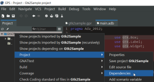
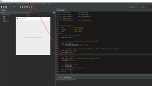

### Ada and GTK+ on windows - hello world sample

Create new project with project wizard.  After initial project creation add project dependency to GtkAda.gpr from "gtk ada" installation folder: \\GtkAda\\lib\\gnat\\gtkada.gpr.

Or you can simply open project file (file with 'gpr' extension) and add "with"  statement :

with "gtkada";

project Gtk2Sample is

   type Build\_Kind is
      ("static", "relocatable");
   LIBRARY\_TYPE : Build\_Kind := external ("LIBRARY\_TYPE");

   case LIBRARY\_TYPE is

      when "static" =>
         for Main use ("main.adb");

      when "relocatable" =>

   end case;

end Gtk2Sample;

"\\GtkAda\\bin" folder should be in the PATH.

And don't forget to add special "windows GUI" directives to the linker, go to **Project/Properties** , under **Build/Switches/Ada Linker** add this directives in the field :

\-Wl,--subsystem,windows

If you don't do this, linker will create "windows console application" and additional command line window will always open with your application.

with Gtk.Box;         use Gtk.Box;
with Gtk.Label;       use Gtk.Label;
with Gtk.Widget;      use Gtk.Widget;
with Gtk.Main;
with Gtk.Window;      use Gtk.Window;

procedure Main is
   Win   	: Gtk\_Window;
   Label 	: Gtk\_Label;
   Box   	: Gtk\_Vbox;
begin
   -- Initialize GtkAda.
   Gtk.Main.Init;

   -- Create a window with a size of 400x400
   Gtk\_New (Win);
   Win.Set\_Default\_Size (400, 400);

   -- Create a box to organize vertically the contents of the window
   Gtk\_New\_Vbox (Box);
   Win.Add (Box);

   -- Add a label
   Gtk\_New (Label, "Hello from Ada and Gtk !");
   Box.Add (Label);

   -- Show the window
   Win.Show\_All;
   -- Start the Gtk+ main loop
   Gtk.Main.Main;
end Main;

If everything was successful, compile / build will create "main.exe"  program file and if  you run from inside GPS  or from the windows file explorer, only the GTK program window should open.

This is probably minimal GTK project, perfect to learn Ada with graphical interface.

If you have problems with the installation, please check if everything is installed properly... You can find some hints [about installation here](https://stackoverflow.com/questions/38424775/how-to-prepare-cygwin-environment-on-windows-10-for-compilation-of-ada-gnatcoll/38468529#38468529).
