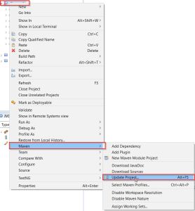

## Define JRE version in maven project definition

When you create new maven project in Eclipse, project is created with java JRE 1.5.  If you wish to change that to something else, you need to add compiler plugin with desired JRE source and target version.

In maven project configuration file (**pom.xml**) add this "maven-compiler-plugin" with setting for source and target version:

<build>
     <plugins>
        <plugin>
                <groupId>org.apache.maven.plugins</groupId>
                <artifactId>maven-compiler-plugin</artifactId>
                <version>3.5.1</version>
                <configuration>
                   <source>1.8</source>
                   <target>1.8</target>
                </configuration>
        </plugin>
    </plugins>
</build>

[More detailed informations](https://maven.apache.org/plugins/maven-compiler-plugin/examples/set-compiler-source-and-target.html) ...

## Refresh Eclipse project

After changing maven project configuration file (pom.xml) you need to refresh eclipse project.

At project level, with right click open Maven submenu and select Update project...

### Other sources :

[Maven for building Java applications - Tutorial](http://www.vogella.com/tutorials/ApacheMaven/article.html)
