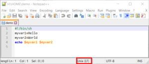
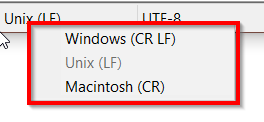
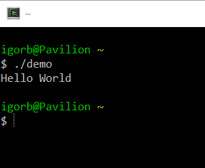

# How to write bash script

I am using [cygwin](https://cygwin.com/install.html) on windows and I wish to use bash as my primary scripting tool.

Write script file with the special first line which define interpreter. Put file in a folder accessible  from anywhere (folder must be on the PATH). Change file characteristics to be executable (chmod +x).

#!/bin/sh
/cygdrive/c/Program\\ Files\\ \\(x86\\)/Notepad++/notepad++.exe $@ &

$ chmod +x note

This script will call notepad++ editor and open file from passed parameters (test.txt).

$ note test.txt

## Unix (LF) - proper line endings

Well, don't forget (like I was), that cygwin is linux on the windows ! It means , your script files need to be in proper format, as on linux.  If you use console editors as for example "nano",  it will work automatically, but with notepad++ (windows app), files will be created with windows line endings by default.

You need to change line endings with right click menu ... to **Unix(LF)** , or on the menu /Edit/EOL Conversion/.

####  Example

#!/bin/sh
myvar1=Hello
myvar2=World
echo $myvar1 $myvar2

If you ran demo script and you didn't get expected **"Hello World"** but only **" World"** maybe, well check your line ending definition.

Want to know more ? Look at this nice little beginners [bash tutorial](http://ryanstutorials.net/bash-scripting-tutorial/) or [special hacker web site](http://wiki.bash-hackers.org/).
