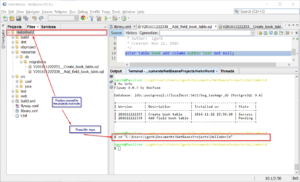

# How to setup migration tool for any IDE

There are many ways how to setup migration tool for a specific project, here I will use a command line approach.

As you already [know by now](https://flywaydb.org/getstarted/), flyway just runs your SQL files with migration DDL commands.  You create new file for each change, incrementally as your database evolve.

We need a folder where we will put files under the project tree.

File names should follow special naming convention for [versioned migrations](https://flywaydb.org/documentation/migration/versioned).

## Command "fw"

Because I use bash (cygwin) environment inside Netbeans IDE, i will first enable "flyway" tool as a command inside cygwin bash terminal. I create "**fw**" command file and put it in the "bin" folder which is on the PATH.

#!/bin/sh
/cygdrive/c/Programs/flyway-4.0.3/flyway $@

## Netbeans project structure

I have simple hello world java web project. I added a resources, db and migrations folders for data migration files:

├── resources
│   └── db
│       └── migrations
│           ├── V201611222253\_\_Create\_book\_table.sql
│           └── V201611222338\_\_Add\_field\_book\_table.sql

## Configuraton

In root folder, where I will run "fw" command, I added configuration file with the name **flyway.conf**. This file contain important config settings for flyway to work.

flyway.url=jdbc:postgresql://localhost:5432/bsg\_taskmgr\_db
flyway.user=postgres
flyway.password=postgres
flyway.schemas=public
flyway.locations=filesystem:./resources/db/migrations

There are many possible settings. You can take prepared flyway.conf file as a base for your configuration file.  Look at **conf** folder under flyway installation folder, there is sample conf file with comments around every possible configuration key.

### Final structure

In simplified view (I omit lot of files here) the structure of a project folder looks like :

.
├── build.xml
├── flyway.conf
├── library.xml
├── build
├── dist
├── nbproject
├── resources
│   └── db
│       └── migrations
│           ├── V201611222253\_\_Create\_book\_table.sql
│           └── V201611222338\_\_Add\_field\_book\_table.sql
├── src
│   ├── conf
│   │   └── MANIFEST.MF
│   └── java
│       ├── com
│       │   └── bisaga
│       │       └── demo
│       │           ├── generated
│       │           ├── HelloResource.java
│       │           └── HelloService.java
│       └── org
│           └── netbeans
│               └── rest
│                   └── application
│                       └── config
│                           └── ApplicationConfig.java
├── test
└── web
    ├── calc.js
    ├── index.html
    ├── META-INF
    │   └── context.xml
    └── WEB-INF
        ├── beans.xml
        └── web.xml

## Migrations SQL files

This two files are simple migration files:

create table book (
    id serial not null,
    title text not null,

    constraint book\_pk primary key (id)
);

and second file where we add new field to the table :

alter table book add column author text not null;

## Running migrations

There are only few commands. For start, you need only two (info and  migrate). After you write your first migration file, just try out "info" command. You should see pending migration record for your SQL file.

###### **$ fw info**

$ fw info

Database: jdbc:postgresql://localhost:5432/bsg\_taskmgr\_db (PostgreSQL 9.4)

+--------------+-------------------+---------------------+---------+
| Version      | Description       | Installed on        | State   |
+--------------+-------------------+---------------------+---------+
| 201611222253 | Create book table |                     | Pending |
+--------------+-------------------+---------------------+---------+

**Now you can migrate first file:**

###### $ fw migrate

$ fw migrate
$ Flyway 4.0.3 by Boxfuse

Database: jdbc:postgresql://localhost:5432/bsg\_taskmgr\_db (PostgreSQL 9.4)
Successfully validated 1 migration (execution time 00:00.012s)
Creating Metadata table: "public"."schema\_version"
Current version of schema "public": << Empty Schema >>
Migrating schema "public" to version 201611222253 - Create book table
Successfully applied 1 migration to schema "public" (execution time 00:01.265s).

After adding next SQL file in "migrations" folder you can again try status of current migrations with "**info**" comand:

$ fw info
$ Flyway 4.0.3 by Boxfuse

Database: jdbc:postgresql://localhost:5432/bsg\_taskmgr\_db (PostgreSQL 9.4)

+--------------+----------------------+---------------------+---------+
| Version      | Description          | Installed on        | State   |
+--------------+----------------------+---------------------+---------+
| 201611222253 | Create book table    | 2016-11-22 23:36:10 | Success |
| 201611222338 | Add field book table |                     | Pending |
+--------------+----------------------+---------------------+---------+

You see there is a Pending change from your last migration file. After another "migrate" command, again this migrations will all be marked as "Installed".

Ok, that's it ! Migrations are now in full working state !

#### How to change "current" folder to "project" folder

For successful execution of any flyway command we need to be in proper folder first. The proper folder is folder where flyway.conf file reside. This is project root folder in my example.

Don't forget to install "TerminalExtras" plugin for Netbeans, then you can just press **Alt+.** when you staying on the project root node. Change directory (cd) command will be executed inside terminal window and focus will be set to terminal window.

