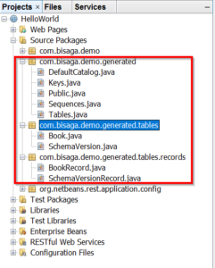

# Add Java object oriented querying - [JOOQ](http://www.jooq.org/) - to project

I love "database first" principle when talking to database. Why would I sacrifice majority of SQL powers, just to talk to database with some ORM technology ? Of course it depend on so many factors, but if you need something very close to database, JOOQ is a way to go.

JOOQ is open source if you use it with open source databases (MySql, Postgres, etc.) !

## Configuration and setup

You need to [download jooq](http://www.jooq.org/download/) library and unzip it to some folder (H:\\JavaLib\\jOOQ-3.8.6).

### [Code generation](http://www.jooq.org/doc/3.8/manual-single-page/#code-generation) config

You need to add jooq config xml file to your project. I added jooq.xml to the root folder.

<?xml version="1.0" encoding="UTF-8" standalone="yes"?>
<configuration xmlns="http://www.jooq.org/xsd/jooq-codegen-3.8.0.xsd">
  <!-- Configure the database connection here -->
  <jdbc>
    <driver>org.postgresql.Driver</driver>
    <url>jdbc:postgresql://localhost:5432/bsg\_taskmgr\_db</url>
    <user>postgres</user>
    <password>postgres</password>
  </jdbc>

  <generator>
    <!-- The default code generator. You can override this one, to generate your own code style.
         Supported generators:
         - org.jooq.util.JavaGenerator
         - org.jooq.util.ScalaGenerator
         Defaults to org.jooq.util.JavaGenerator -->
    <name>org.jooq.util.JavaGenerator</name>

    <database>
      <!-- The database type. The format here is:
           org.util.\[database\].\[database\]Database -->
      <name>org.jooq.util.postgres.PostgresDatabase</name>

      <!-- The database schema (or in the absence of schema support, in your RDBMS this
           can be the owner, user, database name) to be generated -->
           
      <inputSchema>public</inputSchema>
 		
      <!-- All elements that are generated from your schema
           (A Java regular expression. Use the pipe to separate several expressions)
           Watch out for case-sensitivity. Depending on your database, this might be important! -->
      <includes>.\*</includes>

      <!-- All elements that are excluded from your schema
           (A Java regular expression. Use the pipe to separate several expressions).
           Excludes match before includes -->
      <excludes></excludes>
    </database>

    <target>
      <!-- The destination package of your generated classes (within the destination directory) -->
      <packageName>com.bisaga.demo.generated</packageName>

      <!-- The destination directory of your generated classes. Using Maven directory layout here -->
      <directory>./src/java</directory>
      <encoding>UTF-8</encoding>
    </target>
  </generator>
</configuration>

## Run code generator

The simplest way is with bash command, this way will always work, even without any special build tool or IDE.

#!/bin/sh
DIR="C:/Programs/jOOQ-3.10.1/jOOQ-lib/"
DRIVER="C:/Programs/drivers/postgresql-42.1.4.jar"
VER="3.10.1"
CP=$DIR"jooq-"$VER".jar"
CP=$DIR"jooq-meta-"$VER".jar;"$CP
CP=$DIR"jooq-codegen-"$VER".jar;"$CP
CP=$DRIVER";"$CP
echo $CP
java -classpath $CP org.jooq.util.GenerationTool jooq.xml

This script is compatible with git-bash on windows. The libraries and folders are of latest version, change to your specific version before run.

"jooq" script is saved in the "bin" folder which is on the path. Now I can run it from everywhere.

Inside Netbeans, open the terminal and type jooq command, you should be in project root folder, where configuration for jooq is.

### Generated code

Jooq will generate code for all your tables. You will find new files in packages with name "\*.generated.\*" :

