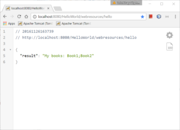

# Configure database access

I use [Apache TomEE](http://tomee.apache.org/index.html) server and therefore I need to configure it for database purpose before first use.

### Install database driver

Drop database [driver jar file](https://jdbc.postgresql.org/download.html) in tomee/lib folder.

### Configure datasource

[Resources](http://tomee.apache.org/containers-and-resources.html) are usually defined in  server configuration file.

Add [datasource](http://tomee.apache.org/common-datasource-configurations.html) resource definition in configuration file located in  tomee/conf/**tomee.xml**.

<?xml version="1.0" encoding="UTF-8"?>
<tomee>  
  <Resource id="jdbc/db" type="javax.sql.DataSource">
    jdbcDriver org.postgresql.Driver
    jdbcUrl jdbc:postgresql://localhost:5432/bsg\_taskmgr\_db
    userName postgres
    password postgres
  </Resource>
</tomee>

### Verify configuration

After server (tomee service) restart, search for your datasource in log (example log file: tomee/logs/catalina.2016-11-26.log). You will find log entry with your resource **id** there:

Configuring Service(id=jdbc/db, type=Resource, provider-id=Default JDBC Database)

If you restart server from inside netbeans,  just search in output window where log entries are shown.

### Inject datasource in java code and use it

To inject instance of datasource where connection is needed you simply add annotation "@Resource" above variable declaration:

@Resource(name = "jdbc/db")
private DataSource ds;

Let's see whole example with select statement ([jOOQ](http://www.jooq.org/)):

package com.bisaga.demo;

import static com.bisaga.demo.generated.tables.Book.BOOK;
import com.bisaga.demo.generated.tables.records.BookRecord;
import java.sql.SQLException;
import javax.annotation.Resource;
import javax.sql.DataSource;
import org.jooq.DSLContext;
import org.jooq.SQLDialect;
import org.jooq.exception.DataAccessException;
import org.jooq.impl.DSL;
/\*\*
 \* @author igorb
 \*/
public class HelloService {

    @Resource(name = "jdbc/db")
    private DataSource ds;    

    public String createHelloMessage(String name) {
        String allBooks = "";
        try {
            DSLContext db = DSL.using(ds, SQLDialect.POSTGRES);
            for(BookRecord b : db.selectFrom(BOOK).fetch() ) {
                allBooks = allBooks.equals("") ? "My books: " : allBooks+";";
                allBooks += b.getTitle();
            }
        } catch (DataAccessException e) {
            System.out.println(e.toString());
        }
        return allBooks;
    }    
}

This example code is called from REST JSON service and result in the browser looks like this:

