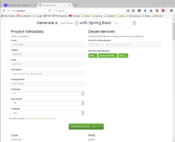

# Setup spring boot application

Simplest way to create "netbeans" ready project is to create project zip file with [spring web wizard](http://start.spring.io) and unpack it somewhere. Open the wizard page and switch to the full version.

Select all needed dependency, for example "web", "jax-rs", jOOQ etc.

After you click on "Generate project" or press Alt+Return, you will get zip file "save as" dialog. This file is created with all necessary configurations to start developing web application.   Just extract it somewhere and open project folder from netbeans.

Created project is [**maven**](http://bisaga.com/blog/programming/maven-installation/) project with "pom.xml" definition file, you will need [maven installed](http://bisaga.com/blog/programming/maven-installation/) on your system.
