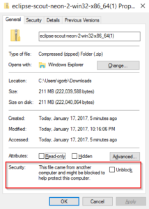
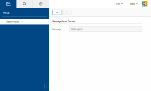

# Eclipse scout

[Java development framework](http://www.eclipse.org/scout/) (HTML5) for rapid development of line of business (LOB) apps.

To download it , go to eclipse packages download page and select [Eclipse for Scout Developers](http://www.eclipse.org/downloads/eclipse-packages/) package.

##### Unblock ZIP file

Before you unzip it somewhere, try to **unblock** zip file first, you will avoid some difficulties later on. Right click on zip file and under Security section check "Unblock".

## 

## Eclipse workspaces

Each scout project consist of a at least few sub-projects.  It will become very crowded very soon if you do not decided to work with multiple workspaces. I open new workspace for each business app, later I will automate cross workspace configurations with [Oomph](https://projects.eclipse.org/projects/tools.oomph).

## Eclipse - git integration

Read [this great tutorial](http://www.vogella.com/tutorials/EclipseGit/article.html) for git integration.

For default repository folder define eclipse variable: ${workspace\_loc}/git, it will create separate repository for each workspace.

### Scout hello world application for version 6.1.

If you create new Scout Hello World sample application and try to run it, at least in current moment in time (Eclipse.Neon.2, with default scout SDK version 6.1.0.M4), application doesn't work.

   <org.eclipse.scout.rt.version>6.1.0.M4</org.eclipse.scout.rt.version>

After run server and client "dev" project in eclipse, open http://localhost:8082/ and application doesn't show main application page, just show something without any style and no javascript support.

Looks like generated hello world wizard doesn't generate latest  project styles (less styles) with proper javascript support as required with 6.1. version of scout SDK. Probably because the version of scout SDK and eclipse tooling (Eclipse version Neon.2) are not in sync.  I didn't won't to change to unstable eclipse version just because of that and maybe that won't solve the problem.

Anyway, I repair hello world example based on "[Contacts](https://github.com/BSI-Business-Systems-Integration-AG/org.eclipse.scout.docs/tree/releases/6.1.x/code)" demo application and publish corrected empty hello world sample on  github project: [scout\_empty](https://github.com/bisaga/scout_empty).

To run "empty" example, open "empty.all.app.dev" project, select "\[webapp\] dev server+ ui.launch" file  and with right click "Run as" launch configuration file.

Open http://localhost:8082/ in browser and you will get something like this:

## Scout application architecture and documentation

To understand scout application architecture download [scout documentation](http://eclipsescout.github.io/6.1/) in PDF or read [Beginner guide](http://eclipsescout.github.io/6.1/beginners-guide.html) and [Technical guide](https://eclipsescout.github.io/6.1/technical-guide.html).

 

### Key binding in Eclipse and Slovenian keyboard

**AltGr+B** => doesn't enter "{" character in java editor, it is "Skip all breakpoints" binding. (Ctrl+Alt+B).

**AltGr+G** => doesn't enter "\]" character , it is "Find Text in Workspace" binding. (Ctrl+Alt+G).
