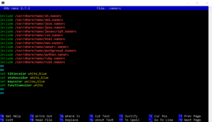

# Nano editor setup

###### Nano terminal editor code syntax highlighting and color setup

Open .nanorc file in your home directory and put this inside:

include /usr/share/nano/sh.nanorc
include /usr/share/nano/xml.nanorc
include /usr/share/nano/json.nanorc
include /usr/share/nano/java.nanorc
include /usr/share/nano/javascript.nanorc
include /usr/share/nano/css.nanorc
include /usr/share/nano/html.nanorc
include /usr/share/nano/man.nanorc
include /usr/share/nano/nanorc.nanorc
include /usr/share/nano/postgresql.nanorc
include /usr/share/nano/python.nanorc
include /usr/share/nano/ruby.nanorc
include /usr/share/nano/rust.nanorc
##
##
set titlecolor white,blue
set statuscolor white,blue
set keycolor yellow,blue
set functioncolor white
##
##

After nano restart editor, your file should look like :

This should work in the **linux** or in **windows/cygwin** environment.
