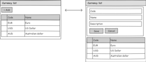
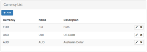
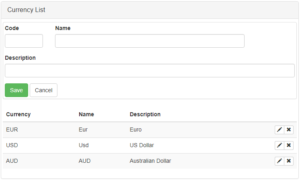
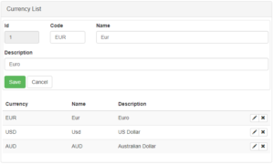

##### You can get [source code](https://github.com/bisaga/SpringBootMyApp) of this project from github repository “[ANGULARMYAPP](https://github.com/bisaga/AngularMyApp)” .

# Edit form

What I wish to accomplish is to enable edit function on the currency list component.  Button "Add" will open editing panel, after saving changes the  editing panel will close.

_The [Pencil](http://pencil.evolus.vn/Default.html) open source product is used for GUI prototyping._

To create new component we use angular command line interface and generate new component skeleton.

\# ng g c currency-edit

After that we add new component to the [currency-list.component](https://github.com/bisaga/AngularMyApp/blob/master/src/app/currency/currency-list/currency-list.component.html) template.

### Some design considerations

New component will contain edit form with two buttons (save and cancel). After adding or editing record the form will be closed automatically. After some changes will be made, the list component will refresh it's data source and the table will refresh it on the screen.

After we look at actions needed in the workflow, it's obvious that the best way is to develop component with two events: save and cancel. The component will work only with events, that way no service interaction will be needed. All interaction will remain in the list component where we already have back-end service injected at the constructor.

**Edit component template file**

  

    

      <form id="currency-edit" (ngSubmit)="onSubmit(f.value)" #f="ngForm">
        

          

            <label for="code">Code</label>
            <input type="text" class="form-control" id="code" \[(ngModel)\]="currency.code" name="code" #codeCtrl="ngModel" required>
          

          

            <label for="abreviation">Name</label>
            <input type="text" class="form-control" id="abbreviation" \[(ngModel)\]="currency.abbreviation" name="abbreviation" #abbreviationCtrl="ngModel"
              required>
          

        

        

          <label for="description">Description</label>
          <input type="text" class="form-control" id="description" \[(ngModel)\]="currency.description" name="description" #descriptionCtrl="ngModel">
        

        

          

            <button class="btn btn-success" type="submit">Save</button>
            <button class="btn btn-default" type="button" (click)="onCancel()">Cancel</button>
          

        

      </form>
    

  

**Edit component class file**

The component is really simple one. I am surprised how little is needed to create a pretty component with binding and events in the angular framework !

import { Component, Input, Output, EventEmitter } from '@angular/core';
import { NgModel, NgForm} from '@angular/forms';
import { Currency } from "app/currency/currency";

@Component({
  selector: 'app-currency-edit',
  templateUrl: './currency-edit.component.html'
})
export class CurrencyEditComponent {
  @Input()  currency: Currency;
  @Output() cancel: EventEmitter<boolean> = new EventEmitter<boolean>(); 
  @Output() save: EventEmitter<Currency> = new EventEmitter<Currency>(); 

  onCancel() {
    this.cancel.emit(true);
  }

  onSubmit(value: Currency) {
    this.save.emit(value);
  }
}

The component is included in the list component with component tag just above the table component and under the "Add" button :

...
    <app-currency-edit 
      \*ngIf="isEdit"
      (cancel)="onCancel($event)" 
      (save)="onSave($event)"
      \[currency\]=currency>
    </app-currency-edit>  
...

In the list component we intercept two events (cancel and save) and call to service layer for back-end actions. With the currency variable we push the selected row to the edit component (this is one way binding).

After each change in the database we refresh the table with changed data.

**List component class**

import { Component, OnInit } from '@angular/core';
import { Currency } from "app/currency/currency";
import { CurrencyService } from "app/currency/currency.service";
import { Observable } from "rxjs/Observable";

@Component({
  selector: 'app-currency-list',
  templateUrl: './currency-list.component.html',
  providers: \[ CurrencyService \]
})
export class CurrencyListComponent implements OnInit {
  title: string = 'Currency List';
  errorMessage: string;
  currencies: Currency\[\];
  currency: Currency;
  isEdit: boolean;

  constructor(private currencyService: CurrencyService) { }

  ngOnInit() {
    this.isEdit = false;
    this.refreshList();
  }

  refreshList() {
    this.currencyService.getCurrencies().subscribe(
      currencies => this.currencies = currencies, 
      error => this.onError(error)
    );
  }

  readCurrency(rowId: number) {
    this.currencyService.getCurrency(rowId).subscribe(
      newValue => {
        this.currency = newValue;
        this.isEdit = true;
      },
      error => this.onError(error)
    );
  }

  onCancel(value: boolean) {
    this.isEdit = !value; 
  }

  onAdd() {
    this.currency = new Currency();
    this.isEdit = true;
  }

  onSave(value: Currency) {
    this.currencyService.updateCurrency(value).subscribe(
      success => {
        this.isEdit = false;     
        this.refreshList();
      },
      error => this.onError(error)
    );
  }

  onEdit(event: Event, rowId: number) {
    this.readCurrency(rowId);
  }

  onDelete(event: Event, rowId: number) {
    var ret: boolean;
    ret = confirm("Are you sure to delete record ?");
    if(ret == true) {
      this.currencyService.deleteCurrency(rowId).subscribe(
        success => this.refreshList(),
        error => this.onError(error)    
      )
    }
  }

  onError(errorMsg: string) {
    this.errorMessage = errorMsg;
  }
}

**And the final template for currency-list component**

  

    
      {{title}}
    
  

  

    

      <button class="btn btn-sm btn-primary" (click)="onAdd()" \*ngIf="!isEdit">
        
        Add</button>
    

    

      
        {{errorMessage}}
      
    

    <app-currency-edit 
      \*ngIf="isEdit"
      (cancel)="onCancel($event)" 
      (save)="onSave($event)"
      \[currency\]=currency>
    </app-currency-edit>  
    
    <table class='table table-responsive table-striped'>
      <thead>
        <tr>
          <th>Currency</th>
          <th>Name</th>
          <th>Description</th>
          <th></th>
        </tr>
      </thead>
      <tbody>
        <tr \*ngFor='let currency of currencies'>
          <td>{{currency.code}}</td>
          <td>{{currency.abbreviation}}</td>
          <td>{{currency.description}}</td>
          <td align="right">
            

            <button class="btn btn-xs btn-default" (click)="onEdit($event, currency.rowId)">
               
            </button>
            <button class="btn btn-xs btn-default" (click)="onDelete($event, currency.rowId)">
               
            </button>
            

          </td>
        </tr>
      </tbody>
    </table>

  

Because every client/server interaction is now asynchronous, the code in the list view component become less readable and little harder to understand. If you need to add any code after the call to the server, you need to add it to the subscribe success part of the observable execution path.

Don't forget, you can always set a callback function as a subscribed success call, that way you retain readability even in more complex scenarios.

I just open the curly brackets after the [fat arrow](https://basarat.gitbooks.io/typescript/content/docs/arrow-functions.html) function and add multiple statements for this simple example.

## The final result

If you click on the "Add" button, the edit form will open and you will be able to add new record to the list.

Edit form will show only input fields enabled for edit (no "Id" field for example).

If you click on the pencil button on a specific row, you open the edit form with the selected data. You can then save or cancel changes. After the action, the edit form is closed (removed from the DOM because of \*ngIf directive), and the data are refreshed automatically.

Of course this is only a "TODO" like application and intentionally I didn't put router into it to remain as simple as possible.

There is always more what can be done, for example edit and delete icons are always enabled, even after the edit form is open. At the edit form, there are no real validation rules before save button can be clicked, there is no error message event and messages don't flow up in the case of validation errors in the edit component etc. However, that are all interesting challenges for later.
