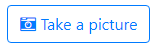
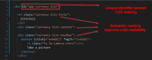
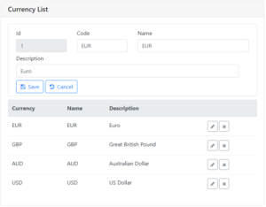

## Create angular project with Sass support

Angular has support for Sass build in. To create angular project with Sass support use the command:

ng new my\_app --style=scss

If you update existing project use the command:

ng set defaults.styleExt scss

## Install Bootstrap 4 with prerequisites

To install bootstrap use command:

npm install bootstrap@4.0.0-beta --save

Bootstrap 4 require jquery & popper.js lib to be installed:

npm install jquery --save
npm install popper.js --save

To check if everything is in place to start using bootstrap check npm modules :

 // list modules installed by user 
npm list -depth=0

The command "npm list" should not print out any errors.

## Using bootstrap and customize it

We need project's scss main file and import bootstrap in it. Under assets folder create new subfolder "scss" and place new "main.scss" file in it.

Add main.scss file into styles array in the .angular-cli.json file.

...
      "styles": \[
        "assets/scss/main.scss"
      \],
...

Add import statement for bootstrap and the file with customized variables to main.scss.

You can also copy content of the node\_modules/bootstrap/scss/\_variables.scss file to your project custom \_variables.scss file and change it as you wish. Some variables use computational functions for colors etc., so you will need to import file with functions first.

@import "~bootstrap/scss/functions";
@import '~assets/scss/\_custom.scss'; 
@import '~bootstrap/scss/bootstrap';

###### Underline as first character of scss files - partials

If the name of the scss file begin with the underline character, it means that file will not be compiled to CSS file. The file represent partial scss file and it must be imported in primary scss file.  So the variables file is actually named "\_custom.scss" and is placed in the assets/scss folder. It is imported into main.scss.

## Font-Awesome Sass integration

Bootstrap 4 does not bring any icon font any more so you can use font awesome for example.

npm install font-awesome --save-dev

Add import statement into main.scss file :

/\* adjust path as needed \*/
$fa-font-path:"~font-awesome/fonts";
@import '~font-awesome/scss/font-awesome.scss';

Sample usage:

    <button (click)="onTake()" \*ngIf="!isCamera">
        <i class="fa fa-camera-retro"></i>
        Take a picture
    </button>

## Separate style from html

To simplify html I prefer to write style information in separate files.

When we use large CSS libraries as Bootstrap, chances are very high, that we will need to replace them later with another css library or our own developed style theme.

So if you wish to be able to change Bootstrap in the future for something more advanced or modern and still use it today, you create your own CSS class definitions and extend bootstrap classes.

 

For each angular component create separated partial scss file and import it in the main.scss file.

@import "~bootstrap/scss/functions";
@import '~assets/scss/\_custom.scss'; 
@import '~bootstrap/scss/bootstrap';

/\* adjust path as needed \*/
$fa-font-path:"~font-awesome/fonts";
@import '~font-awesome/scss/font-awesome.scss';

@import '~app/currency/currency-list/\_currency-list.component.scss';
@import '~app/currency/currency-edit/\_currency-edit.component.scss';

#app {
    @extend .container-fluid;
    padding: 0.5rem;
}

 

Name root html tag of each component with an **ID** so you can create styles in the **hierarchy,** valid only for the specific component, without leaking to any other part of the application.

  <h5 class="currency-list-title">
    {{title}}
  </h5>
  

    

      <button (click)="onAdd()" \*ngIf="!isEdit">
        <i></i>Add
    </button>
    

    

      
        {{errorMessage}}
      
    

    <app-currency-edit \*ngIf="isEdit" (cancel)="onCancel($event)" (save)="onSave($event)" \[currency\]=currency>
    </app-currency-edit>

    <table>
      <thead>
        <tr>
          <th>Currency</th>
          <th>Name</th>
          <th>Description</th>
          <th></th>
        </tr>
      </thead>
      <tbody>
        <tr \*ngFor='let currency of currencies'>
          <td>{{currency.code}}</td>
          <td>{{currency.abbreviation}}</td>
          <td>{{currency.description}}</td>
          <td>
            

              <button class="edit-button" (click)="onEdit($event, currency.rowId)">
                <i></i>
                
              </button>
              <button class="delete-button" (click)="onDelete($event, currency.rowId)">
                  <i></i>
                  
              </button>
            

          </td>
        </tr>
      </tbody>
    </table>
  

Styles are created in SCSS files inside component id selector:

#app-currency-list {
    @extend .card;

    .currency-list-content {
        @extend .card-body;
    }

    .currency-list-title {
        @extend .card-header;
    }

    .currency-list-toolbar {
        @extend .btn-toolbar; 

        button {
            @extend .btn;
            @extend .btn-outline-primary;
        }
        i { 
            @extend .fa; 
            @extend .fa-plus;
            padding-right: 0.5rem;
        }
    }
    
    table {
        margin-top: 10px;
        @extend .table;

        thead {
            @extend .thead-default;
        }
    }

    .edit-button {
        @extend .btn;
        @extend .btn-outline-secondary;
        @extend .btn-sm;
        
        i {        
            @extend .fa; 
            @extend .fa-pencil;
        }
    }

    .delete-button {
        @extend .btn;
        @extend .btn-outline-secondary;
        @extend .btn-sm;

        i {
            @extend .fa; 
            @extend .fa-remove;
        }
    }

}

To use specific bootstrap class as your own, you need to extend it. You can use one or more classes in the single [@extend](http://sass-lang.com/guide) statement.

Create your css selector names with semantic naming, that way your html code will become self descriptive and maintainable in the future.

Component declaration doesn't use the scss files and we retain default view encapsulation of the component.

import { Component, OnInit } from '@angular/core';
import { Currency } from "app/currency/currency";
import { CurrencyService } from "app/currency/currency.service";
import { Observable } from "rxjs/Observable";

@Component({
  selector: 'app-currency-list',
  templateUrl: './currency-list.component.html',
  providers: \[ CurrencyService \]
})
export class CurrencyListComponent implements OnInit {
  title: string = 'Currency List';
  errorMessage: string;
  currencies: Currency\[\];
  currency: Currency;
  isEdit: boolean;

  constructor(private currencyService: CurrencyService) { }

  ngOnInit() {
    this.isEdit = false;
    this.refreshList();
  }

  refreshList() {
    this.currencyService.getCurrencies().subscribe(
      currencies => this.currencies = currencies, 
      error=> this.onError(error)
    );
  }

  readCurrency(rowId: number) {
    this.currencyService.getCurrency(rowId).subscribe(
      newValue => {
        this.currency = newValue;
        this.isEdit = true;
      },
      error => this.onError(error)
    );
  }

  onCancel(value: boolean) {
    this.isEdit = !value; 
  }

  onAdd() {
    this.currency = new Currency();
    this.isEdit = true;
  }

  onSave(value: Currency) {
    this.currencyService.updateCurrency(value).subscribe(
      success => {
        this.isEdit = false;     
        this.refreshList();
      },
      error => this.onError(error)
    );
  }

  onEdit(event: Event, rowId: number) {
    this.readCurrency(rowId);
  }

  onDelete(event: Event, rowId: number) {
    var ret: boolean;
    ret = confirm("Are you sure to delete record ?");
    if(ret == true) {
      this.currencyService.deleteCurrency(rowId).subscribe(
        success => this.refreshList(),
        error => this.onError(error)    
      )
    }
  }

  onError(errorMsg: string) {
    this.errorMessage = errorMsg;
  }

  log(msg: string, val?: any) {
    console.log(msg);
    console.log(val);
  }
}

The compiled CSS file is only one for whole application.

Redesigned currency example now looks like this :

