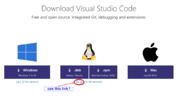

# Elementary OS - linux distribution

On one of my machines I use ElementaryOS linux. This flavor of linux does not support DEB or RPM packages directly so I will use tar.gz file as installation medium.

## Download

Download code\*\*\*.tar.gz file from [https://code.visualstudio.com/Download](https://code.visualstudio.com/Download) address. Link to **.tar.gz** is under the “deb” square.

## Install

Open terminal and go to /usr/local directory. Unpack tar.gz file into default folder and create soft-link to code application:

cd /usr/local
sudo tar xvfz ~/Download/code\*\*\*\*.tar.gz 
ln -s /usr/local/VSCode-linux-x64/Code /usr/local/bin/code

## Update

To update with a new version just download latest version of tar.gz package and unpack it to the same location. It is wise to delete (or rename) original folder first and then unpack new one.

sudo mv VSCode-linux-x64/ VSCode-linux-x64-OLD/
sudo tar xvfz ~/Download/code\*\*\*\*.tar.gz 
sudo rm -rf VSCode-linux-x64-OLD/

## Run and keep shortcut in the dock

We run code editor with "code" command. With the right click on the running program icon (in the dock), we change settings for "keep in Dock" and the program shortcut will stay in the dock.
