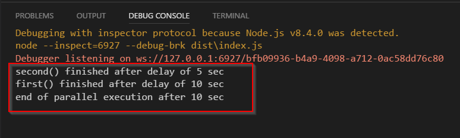

## JavaScript is single threaded

Everything running in JavaScript is running in the single OS process and consume a single thread. But when you are waiting for something outside the JavaScript process to happen, like waiting for database query to be executed or some file stream reader to load a file, you are able to return control back to your main JavaScript event loop and therefore any new event/request in your JavaScript program will be processed in the meantime.

It means your JavaScript program, if written properly, will never really waiting. It just runs all the time.

## Async/Await pattern

Returning control to JavaScript event loop when waiting something outside JavaScript to happen,  is not automatic. You need to specify this manually in code with proper use of "Promise" objects and async/await functionality.

Sometimes the promise object is implicitly defined by "async" keyword in front of the function but on the end you always work with the promises.

## Using asynchronous programming with TypeScript

To learn how to properly use promises and async/await in typescript I create a very small web application.

## Create minimal server app

For this mini app I use Koa server. The app will support two routes: "/" and "/start".  With "start" I will start long running operation and with "/" route I will check if server is still available and responsive.

Prepare project for sample code

npm install koa @types/koa koa-router @types/koa-router node-fetch @types/node-fetch --save

 

After running the sample (index.ts) node application we should be able to start long running task with navigating to "localhost:3002/start" address and in the same time check if the same server is still active and responsive with default route "localhost:3002" which show new value of the counter after each refresh.

Long running task will not always succeed, only when random value is higher then 500 will. If value is lower then the error is thrown and implemented error handling intercept it with try/catch block.

Code for this sample app:

import \* as Koa from "koa";
import \* as Router from "koa-router";
import fetch from "node-fetch";

async function long\_run(): Promise<number> {
    const rnd = Math.round(Math.random() \* 1000);
    if (rnd > 500) {
        for (let i = 0; i < 10; i++) {
            const response = await fetch("https://www.google.com/search?q=typescript");
        }
        return rnd;
    } else {
        throw new Error(\`ERROR: The value (${rnd}) is under 500.\`);
    }
}

async function start(ctx: Router.IRouterContext): Promise<number> {
    let message = "";
    let result: number;
    try {
        result = await long\_run();
        console.log(\`This is inside start, after long\_run ${result}\`);
        message = \`Returned from long run: ${result}\`;
    } catch (e) {
        message = \`Intercepted \[${e.message}\] exception.\`;
        result  = -1;   // we didn't receive a value if throw is intercepted from await !
                        // Promise was rejected, value is not available.
    }
    // form the web response
    ctx.body = message;
    ctx.status = 200;
    return result;
}

const router = new Router();
router.get("/start", async (ctx, next) => {
    const res = await start(ctx);
    const status = res === -1 ? "Error" : "Success";
    console.log(\`Long running task finished with ${status}.\`);
    await next();
});

router.get("/", async (ctx, next) => {
    counter++;
    ctx.body = \`You ran for the ${counter} times.\`;
    ctx.status = 200;
    await next();
});

let counter = 0;
const app = new Koa();
const port = 3002;

app.use(router.routes());
app.use(router.allowedMethods());
app.listen(port, () => console.log(\`Server listen on port ${port}\`) );
app.on("error", (e) => console.log(\`SEVERE ERROR: ${e.message}\`) );

As we see the code looks more or less like ordinary synchronously written one except **async** keyword used in function declaration and **await** keyword where asynchronous methods are called.

## Promise

If function is marked as async then the function will automatically return promise object. If function doesn't have return statement, then this promise will be void (Promise<void>). If you write return with some real value, then promise will represent that value. Function will automatically wrap your value and return promise with it. Returning a value from async function means resolving the promise. If you throw exception from async function means your promise will be rejected.

**Writing promise by hand**

let p = new Promise((resolve, reject) => {
    const ok = true; // do something 
    if (ok) {
        resolve(ok);  // same as "return ok;" if function is async  
    } else {
        reject("Error - failed promise"); // same as throw in async function
    }
});

p.then( ... )    // "then" is executed after await return back  
 .catch( ... );  // "catch" is actually catch part of try/catch block

If you use async functions what's really behind is actually exactly the same as when you work with promises directly, just syntactically is more synchronous looking and much more readable.

### Working with multiple async functions in parallel

If you need to execute more then one function in parallel, you need to use **Promise.all**( \[ array of promises\] ).

import fetch from "node-fetch";

// this is "promisified" timeout, can be used with await
function delay(ms: number): Promise<void> {
    return new Promise((resolve) => {
        setTimeout(resolve, ms);
    });
}

async function first(): Promise<boolean> {
    try {
        await delay(10000); // 10 sec long task 
        console.log("first() finished after delay of 10 sec");
        return true;
    } catch (error) {
        throw(error);
    }
}

async function second(): Promise<boolean> {
    try {
        await delay(5000); // 5 sec long task 
        console.log("second() finished after delay of 5 sec");
        return true;
    } catch (error) {
        throw(error);
    }
}

async function parallel() {
    let isFirstFinished = false;
    let isSecondFinished = false;
    try {
        const start = (new Date()).getTime();

        \[isFirstFinished, isSecondFinished\] = await Promise.all(\[first(), second()\]);

        const end = (new Date()).getTime();
        const diff = Math.round((end - start) / 1000);
        console.log(\`end of parallel execution after ${diff} sec\`);
    } catch (error) {
        console.log(error);
    }
}

parallel();

The parallel call is made in the line :

\[isFirstFinished, isSecondFinished\] = await Promise.all(\[first(), second()\]);

Await in "parallel()" function will be called back after all promises will be resolved. The longest operation in array of promises define the maximum time spend here.

