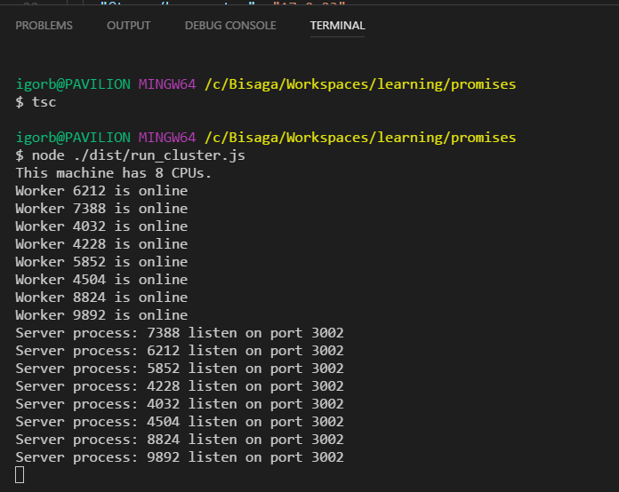
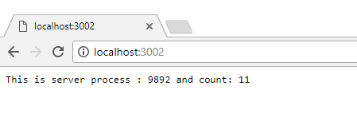

## Cluster

Any JavaScript program runs in single OS process but of course is able to process requests asynchronously.  On the Node server we are able to start multiple processes.  To do that we use [cluster](https://www.sitepoint.com/how-to-create-a-node-js-cluster-for-speeding-up-your-apps/) module, so you are not really limited to one CPU core anymore.

Before start you need to install project prerequisites:

npm install koa @types/koa koa-router @types/koa-router node-fetch @types/node-fetch --save

If you need help with basic project setup look at [this blog article](http://bisaga.com/blog/programming/setting-up-the-environment-for-nodejs-and-typescript/) where I describe basic setup steps.

## Create Koa web server application

The purpose of this server application is for testing cluster technology only.  The application support two routes , first is default route (/) for checking on which process runs and another (/stop) for stopping active process. The console log show workers statuses from starting , stopping and restarting.

import \* as Koa from "koa";
import \* as Router from "koa-router";

export class ServerRun {
    private port: number;
    private app: Koa;
    private router: Router;
    private count: number;

    public constructor(port: number) {
        this.port = port;
        this.app = new Koa();
        this.router = new Router();
        this.count = 0;
    }

    public start() {
        this.router.get("/", async (ctx, next) => {
            this.count++;
            ctx.body = \`This is server process : ${process.pid} and count: ${this.count}\`;
            ctx.status = 200;
            await next();
        });

        this.router.get("/stop", async (ctx, next) => {
            console.log(\`Stopping server process : ${process.pid}\`);
            process.exit(1);
            await next();
        });

        this.app.use(this.router.routes());
        this.app.use(this.router.allowedMethods());

        const server = this.app.listen(this.port, () => {
            console.log(\`Server process: ${process.pid} listen on port ${this.port}\`);
        });

        this.app.on("error", (e) => console.log(\`SEVERE ERROR: ${e.message}\`) );
    }
}

If you want to **debug** this server application just create simple index.ts and start the ServerRun class.

// Run server for debug in single process without cluster
import {ServerRun} from "./server\_run";

const app = new ServerRun(3002);
app.start();

## Create cluster server start

To start this server in the cluster we need to fork process workers and start koa application.

import \* as cluster from "cluster";
import {ServerRun} from "./server\_run";

import {cpus} from "os";

const numCPUs = cpus().length;

if (cluster.isMaster) {
    console.log(\`This machine has ${numCPUs} CPUs.\`);
    for (let i = 0; i < numCPUs; i++) {
        cluster.fork();
    }

    cluster.on("online", (worker) => {
        console.log(\`Worker ${worker.process.pid} is online\`);
    });

    cluster.on("exit", (worker, code, signal) => {
        console.log(\`Worker ${worker.process.pid} died with code: ${code} and signal: ${signal}\`);
        console.log("Starting a new worker...");
        cluster.fork();
    });

} else {
    const app = new ServerRun(3002);
    app.start();
}

To start this server we need to compile everything to TypeScript first and then start node with "run\_cluster" procedure.

tsc
node ./dist/run\_cluster.js

As we see on the console the server start multiple processes and listen on the same port. Well, that's whole point, to be able to send requests to the same address and server will divide load to multiple processes.

### Test the server

Now if you go to browser and navigate to "localhost:3002/", the server will respond with value of the current process id and count variable. Try refreshing multiple times, the counter will always increase by 1. If you then kill the process and navigate again, you will get another process id and the counter will start again with one. Each process has his own Koa application instance.

## Kill the process and test server robustness

If you navigate to "localhost:3002/stop", you will essentially kill current process. After irrecoverable failure on the server process,  cluster "exit" event is triggered and we simply start new process again.

Stopping server process : 9892
Worker 9892 died with code: 1 and signal: null
Starting a new worker...
Worker 7040 is online
Server process: 7040 listen on port 3002
