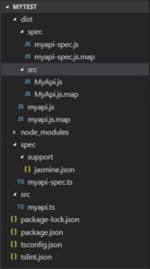
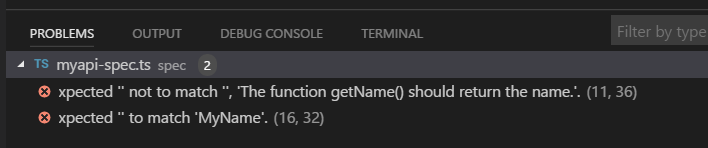
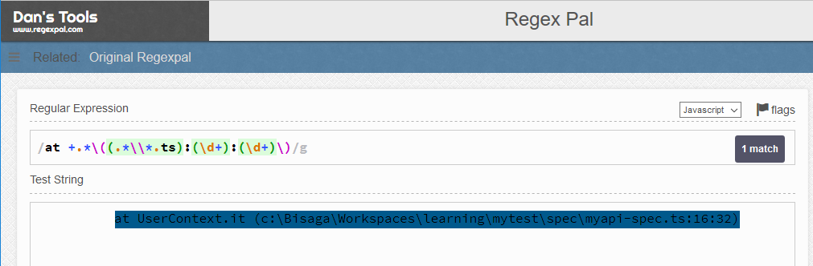

# Setup Jasmine testing framework with Node and TypeScript

My typescript project setup is described in [this](http://bisaga.com/blog/programming/setting-up-the-environment-for-nodejs-and-typescript/) article. To be able to write tests in typescript with [Jasmine framework](https://jasmine.github.io/) we need to setup project environment with some Jasmine specifics.

This scaffold project [is also available on the github](https://github.com/bisaga/Jasmine).

**Initialize typescript compiler and linter :**

npm install typescript@latest --save-dev
tsc --init --moduleResolution node --target ES2017 --sourceMap --module commonjs --removeComments --outDir dist 

npm install tslint --save-dev
tslint --init

npm install @types/node --save-dev

Compiled javascript files for code and jasmine test specifications will be saved to "dist" folder.

**Now we need to install Jasmine and jasmine to typescript reporter:**

npm install jasmine @types/jasmine --save-dev
npm install jasmine-ts-console-reporter --save-dev

Jasmine typescript console reporter (jasmine-ts-console-reporter) will report errors based on typescript files instead of javascript files. It will tell you which test and the location in the file failed referring to typescript files instead of javascript files.

**Initialize jasmine in your project :**

./node\_modules/.bin/jasmine init

Change generated jasmine.json to match this one:

{
  "spec\_dir": "dist/spec",
  "spec\_files": \[
    "\*\*/\*\[sS\]pec.js"
  \],
  "helpers": \[
    "helpers/\*\*/\*.js"
  \],
  "stopSpecOnExpectationFailure": false,
  "random": false
}

Create special helper to enable "jasmine to typescript" console reporter. In the spec/helpers folder add new file "ts\_console.ts" with the content:

// tslint:disable-next-line:no-var-requires
const TSConsoleReporter = require("jasmine-ts-console-reporter");

jasmine.getEnv().clearReporters(); // Clear default console reporter
jasmine.getEnv().addReporter(new TSConsoleReporter());

## Prepare test code

Write some program logic and tests:

export class MyApi {
    public getName(): string {
        return "";
    }
}

To test this simple api we create "myapi-spec.ts" file in the spec folder:

import {MyApi} from "../src/MyApi";

describe("MyApi getName function return value", () => {
    it("Should be defined.", () => {
        const myapi = new MyApi();
        expect(myapi.getName()).toBeDefined("The function getName() should be defined.");
    });

    it("Should't return blank.", () => {
        const myapi = new MyApi();
        expect(myapi.getName()).not.toMatch("", "The function getName() should return the name.");
    });

    it("Should return 'MyName'" , () => {
        const myapi = new MyApi();
        expect(myapi.getName()).toMatch("MyName");
    });

} );

### The full project structure:

To compile all typescript to javascript run "tsc" command in the root of the project.

tsc

And to run jasmine tests we run locally installed jasmine with the command:

./node\_modules/.bin/jasmine

If everything is correct, jasmine will report result of the run in the console:

Started
.FF

Failures:
1) MyApi getName function return value Should't return blank.
  Message:
    Expected '' not to match '', 'The function getName() should return the name.'.
  Stack:
        at UserContext.it (c:\\Bisaga\\Workspaces\\learning\\mytest\\spec\\myapi-spec.ts:11:36)

2) MyApi getName function return value Should return 'MyName'
  Message:
    Expected '' to match 'MyName'.
  Stack:
        at UserContext.it (c:\\Bisaga\\Workspaces\\learning\\mytest\\spec\\myapi-spec.ts:16:32)

3 specs, 2 failures
Finished in 0.025 seconds

Because we add additional "typescript console reporter" to jasmine, the errors reported are referenced to **typescript (.ts) files** with **exact line/column** and error message.

## Integrate jasmine test results with Code editor

First we need to understand how vs code editor [tasks](https://code.visualstudio.com/Docs/editor/tasks) works. As we see in jasmine report, each failure is described in multiple lines. The problem matcher should analyze multiple lines pattern, this is described [here](https://code.visualstudio.com/Docs/editor/tasks#_defining-a-multiline-problem-matcher).

**Problems tab should display errors in tests after test run**

Create task for running jasmine and to intercept errors as "problems" in the visual studio code problems tab:

As we see in the screenshot, the exceptions in jasmine test results are intercepted by vs code editor and presented as "problems".  If you click on the single problem line, the file under the error will be opened and cursor will be moved to the corresponding location.

### Task

In the .vscode folder create "tasks.json" file with the jasmine command and additional logic to parse results (problemMatcher) :

{
    "version": "0.1.0",
    "isShellCommand": false,
    "showOutput": "always",
    "tasks": \[
        {
            "taskName": "run test",
            "showOutput": "always",
            "command": "npm",
            "args": \[
                "run", 
                "test"
            \],
            "problemMatcher": {
                "owner": "javascript",
                "fileLocation": \["absolute"\],
                "severity": "error",
                "pattern": \[
                    {
                        "regexp": "Message.\*"
                    },
                    {
                        "regexp": "\[^ \](.\*)",
                        "message": 1
                    },
                    {
                        "regexp": "Stack.\*"
                    },
                    {
                        "regexp": "at +.\*\\\\((.\*\\\\\\\\\*.ts):(\\\\d+):(\\\\d+)\\\\)",
                        "file": 1,
                        "line": 2,
                        "column": 3
                    }
                \]
            }
        }
    \]
}

### How to write regular expressions

If you will study the pattern matching you should remember that matcher works on the console results line by line. All patterns together (all regexp lines patterns) represent one intercepted error.

If you need to change any of patterns in the future, the regex string in the tasks.json file is written in the "escaped" form. To develop and test patterns interactively, use this [interactive javascript regex tester](https://www.regexpal.com/).  You can copy specific line from the result (line by line!) into the regex tester and develop a pattern to recognize searched variables.

Un-escaped form:  at +.\*\\((.\*\\\\\*.ts):(\\d+):(\\d+)\\)
Escaped form:     at +.\*\\\\((.\*\\\\\\\\\*.ts):(\\\\d+):(\\\\d+)\\\\)

**Some problems still exists:**

Because the matching is done line by line, when console window is small, and the lines are wrapped, they are not consistent with the written lines from the jasmine reporter anymore. The reported errors are wrapped at the width of the console and pattern matching doesn't recognize them as errors any more.

You can somehow mitigate that with larger terminal window or with smaller terminal window font. This way the reported errors will remain in single lines consistent with the jasmine reporter. I wish that this wrapping could be disabled but for now it is not an option.

To change the size of the font in the terminal window add this settings to the settings.json file:

    "terminal.integrated.fontFamily": "Consolas, 'Courier New', monospace",
    "terminal.integrated.fontSize": 10,

Anyway, this problem is [already recognized](https://github.com/Microsoft/vscode/issues/32042) and I hope it will be resolved in the future.
