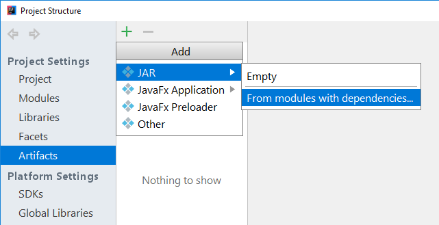
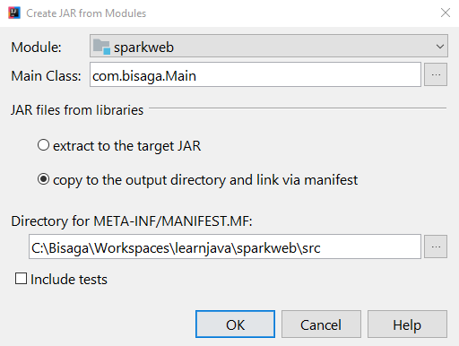
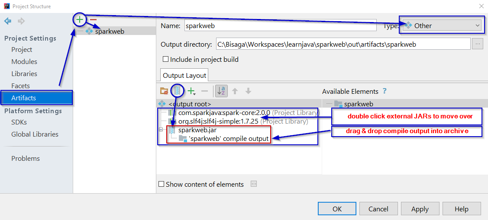
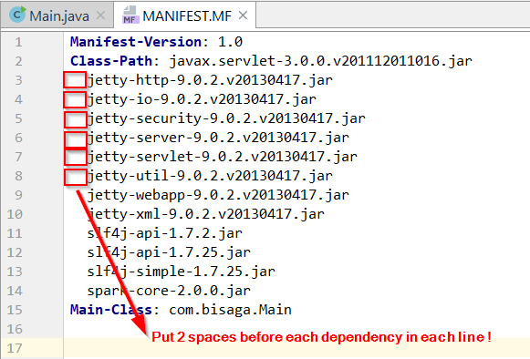

To create executable JAR we need to create new artifact and build it. Build will save everything to the output folder.

The version of java used in the article was 1.8.

## Automatically created build artifact:

1. Open File/Project structure
2. Create new artifact, JAR, from modules with dependencies: 
3. Enter proper **startup class** and select proper function how to use external 3rd party libraries in the target artifact ("**copy to the output directory and link via manifest**"). We don't want to extract them to the target JAR file because some of them are probably signed and those will not work inside the target JAR.  

Now you can build artifact from the menu (/**Build/Build artifact**/) and test it from the command line:

$ java -jar out/artifacts/sparkweb/sparkweb.jar

## Customized way of defining build artifact

If you wish to have more influence on target artifact then you use "Other" artifact type and design the process manually:

You can move external libraries into some sub folder for example and then create manifest file manually to reflect that new class path.

**Sample manifest file**:

If you edit MANIFEST.MF file just don't forget to put **two spaces** between the jar files.

Manifest-Version: 1.0
Class-Path: javax.servlet-3.0.0.v201112011016.jar
  jetty-http-9.0.2.v20130417.jar
  jetty-io-9.0.2.v20130417.jar
  jetty-security-9.0.2.v20130417.jar
  jetty-server-9.0.2.v20130417.jar
  jetty-servlet-9.0.2.v20130417.jar
  jetty-util-9.0.2.v20130417.jar
  jetty-webapp-9.0.2.v20130417.jar
  jetty-xml-9.0.2.v20130417.jar
  slf4j-api-1.7.2.jar
  slf4j-api-1.7.25.jar
  slf4j-simple-1.7.25.jar
  spark-core-2.0.0.jar
Main-Class: com.bisaga.Main

Read [this blog](http://karthicraghupathi.com/2016/07/10/creating-an-executable-jar-in-intellij-idea/) for more detailed instructions..

**Why we don't create a single JAR from everything**

Create one single JAR from everything the application consist is not a good idea because of security limitations. If any of 3rd party jar libraries is signed then the signature represent physical JAR file and when code is loaded from another  jar file (your single jar) the load mechanism will prevent loading because the signature doesn't represent the jar file anymore.
