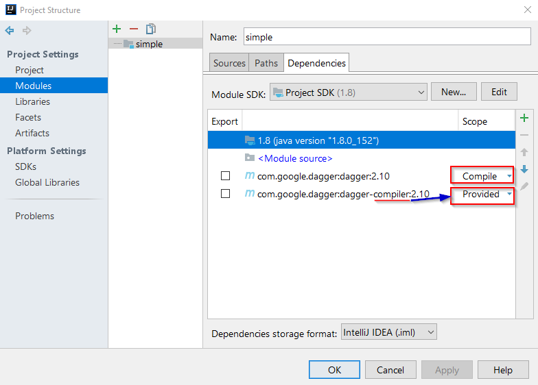
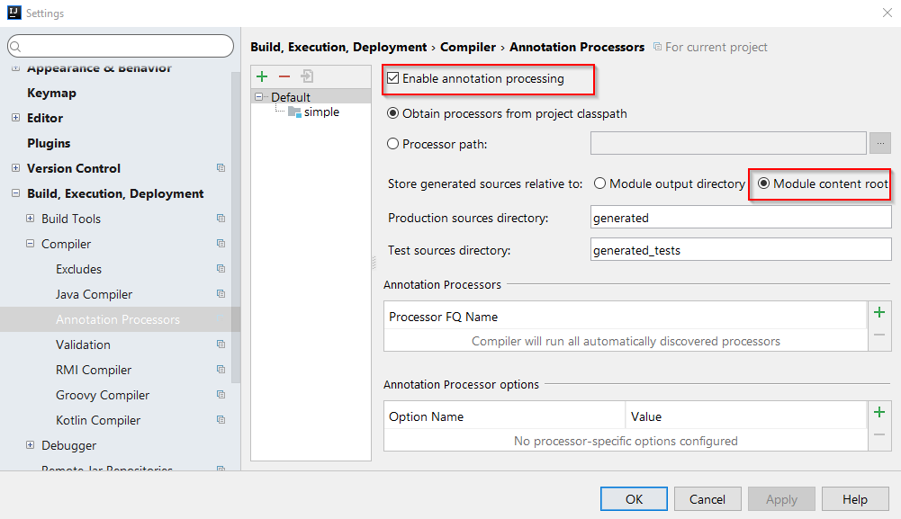
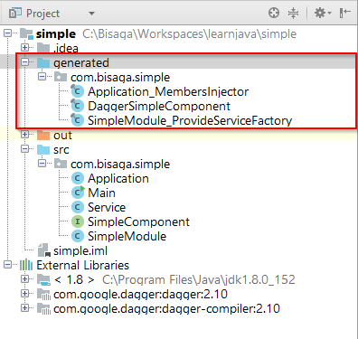

# Prepare project to use [dagger](https://google.github.io/dagger/) DI in IntelliJ IDE

The IntelliJ IDEA Community version 2017.2.5 is used in this example.

Open project structure and add dagger as project dependency from Maven repository.

- com.google.dagger:dagger:2.10
- com.google.dagger:dagger-compiler:2.10

The dagger compiler has to be available only for development phase (annotation processing will generate code) so we added it as "Provided" dependency.

Enable annotation processing in the project settings and select content root for generated code.

If you wish to inspect generated code in the project tree it is wise to open "generated" folder manually and mark it as "Source root".  After compiling the project tree will look like this:

# Create simple service application

First we will create very simple application without DI. The service application will consist of one Application class starting everything up and with single Service class doing some work.

package com.bisaga.simple;
public class Main {
    public static void main(String\[\] args) {
        Application app = new Application();
        app.run();
    }
}

package com.bisaga.simple;

public class Application {
    private Service service;

    public Application() {
        service = new Service();
    }

    public void run() {
        System.out.println("Application start.");
        service.doWork();
        System.out.println("Application end.");
    }
}

package com.bisaga.simple;

public class Service {

    public void doWork() {
        System.out.println("Service do work.");
    }
}

## Implement dagger dependency injection

To start as simple as possible we will not change how the application is instantiated and started.  The dagger is initialized in the Application object and the only injected instance will be the instance of Service class.

package com.bisaga.simple;
public class Main {
    public static void main(String\[\] args) {
        Application app = new Application();
        app.run();
    }
}

Now we need to create  "**Module**" object where we implement "provide" method to provide new instance of the service class. The module class must have @Module annotation and factory methods must have @Provides annotations.

package com.bisaga.simple;

import dagger.Module;
import dagger.Provides;

@Module
public class SimpleModule {

    @Provides
    Service provideService() {
        return new Service();
    }
}

Now we need a "**Component**" object which is an interface from which dagger generate injector class.  The component must contain a @Component annotation with defined modules and inject function signature.

package com.bisaga.simple;

import dagger.Component;
import javax.inject.Singleton;

@Singleton
@Component(modules = { SimpleModule.class})
public interface SimpleComponent {
    void inject(Application application);
}

The service class was not changed because we do not inject anything there, the service has no external requirements, so the code stay exactly the same as before:

package com.bisaga.simple;

public class Service {

    public void doWork() {
        System.out.println("Service do work.");
    }
}

### Connect everything together

In the Application constructor we initialize the dagger with the build() and inject() functions. The injection is achieved with the **@Inject** annotation in front of the local "service" member declaration.

package com.bisaga.simple;
import javax.inject.Inject;

public class Application {
    private SimpleComponent component;

    @Inject Service service;

    public Application() {
        component = DaggerSimpleComponent.builder().build();
        component.inject(this);
    }

    public void run() {
        System.out.println("Application start.");
        service.doWork();
        System.out.println("Application end.");
    }
}

If a dagger want to inject a class member it must be publicly accessible because it is not using any reflection (that's good for speed and debugging!). But we could also initialize private variables with the use of constructors marked with annotation @Inject taking in all required parameters.

## Extending our knowledge

**@Inject on the constructor instead of provide method**

Now we could explain that provideXXX methods in the modules are not the only way how to explain to dagger how to construct the objects ... We can instead of the method simpy annotate constructor of the object with @Inject.

Because only one constructor can have the @Inject annotation the dagger know exactly how the object should be constructed. The special provideXXX method on the module is not needed anymore.

Try to add constructor to Service class annotated with @Inject and delete provideService() method from the "SimpleModule" class , rebuild the project and everything should work as before. You can observer generated classes because know the daggergenerate special factory object with construction mechanism.

The code after changes should look like:

package com.bisaga.simple;

import javax.inject.Inject;

public class Service {

    @Inject
    public Service(){}

    public void doWork() {
        System.out.println("Service do work.");
    }
}

and the module:

package com.bisaga.simple;

import dagger.Module;

@Module
public class SimpleModule {
}

 

## More about the topic

DI and the dagger tool has many features not covered in this article. You can find more about them [here](http://www.vogella.com/tutorials/Dagger/article.html) .

<iframe width="700" height="393" src="https://www.youtube.com/embed/plK0zyRLIP8" frameborder="0" allowfullscreen="allowfullscreen"></iframe>
