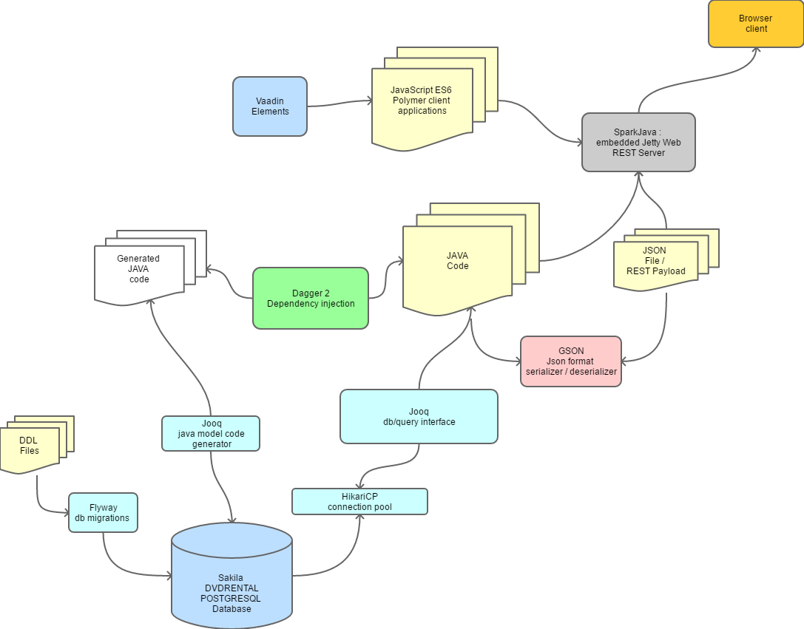
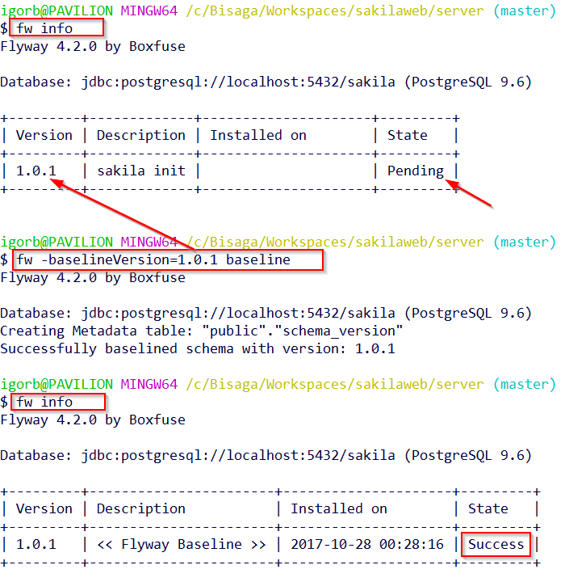
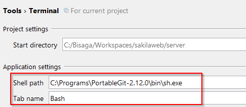
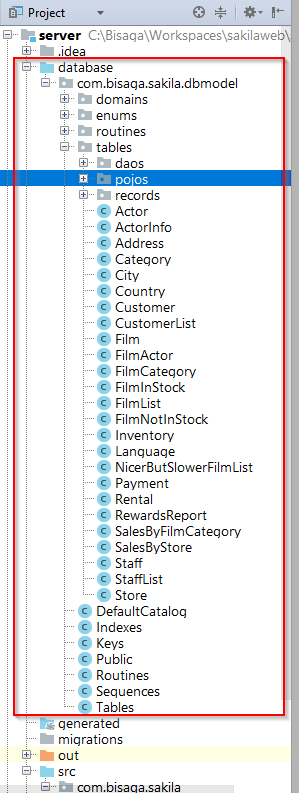
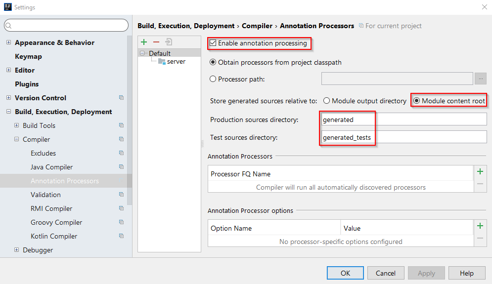
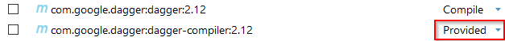
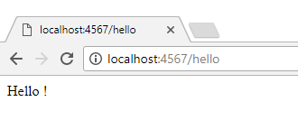

This sample application will integrate quite a few very nice open source tools available to every developer:

- Postgresql - database
- Flyway - database migration tool
- Jooq - Java object oriented querying + HikariCP connection pool
- Dagger 2 - dependency injection
- SparkJava - fast and simple web server + GSON Json serializer
- JavaScript Polymer SPA application framework
- Vaadin Elements components

The application will consist of many modules :

## Postgresql - database

Initialize sample database

For start we will install [sample sakila database ](http://www.postgresqltutorial.com/postgresql-sample-database/) in the local Postgresql database. [Restore](http://www.postgresqltutorial.com/load-postgresql-sample-database/) downloaded file into locally created database.

C:\\Program Files\\PostgreSQL\\9.6\\bin\\pg\_restore.exe --host "localhost" --port "5432" --username "postgres" --no-password --dbname "sakila" --no-owner --no-tablespaces --verbose "C:\\\\DVDRENTAL.TAR"

Sakila sample database is open source demo database and represent [database model](http://www.postgresqltutorial.com/postgresql-sample-database/) of DVD rental store. It  consist of  15 relational tables, 7 views and few other database details and it's full of data.

Well that's database with full of test data for development environment. If we need empty database (for production for example) we need to start initialization DDL script to build the database.

To create the script from the existing database use the command [pg\_dump](https://www.postgresql.org/docs/9.6/static/app-pgdump.html) which is capable of exporting database in the form of sql commands :

pg\_dump -s -U postgres sakila > V1.0.1\_\_sakila\_init.sql

To export database without any data , only schema definitions we use "schema only" (**\-s**) option.

### Flyway migrations

Create [flyway](http://bisaga.com/blog/programming/flyway-setup-inside-java-project/) config file and "migrations" folder under the project root.

flyway.url=jdbc:postgresql://localhost:5432/sakila
flyway.user=postgres
flyway.password=postgres
flyway.schemas=public
flyway.locations=filesystem:./migrations

Add "fw" command somewhere on the path.

#!/bin/sh
/c/Programs/flyway-4.2.0/flyway $@

Put the "V1.0.1\_\_sakila\_init.sql" file in the migrations folder. If everything works as expected the "info" command should report the pending migration.

**Flyway migration and initial database state after database restore**

After restoring the database with test data in it we need to "baseline" initial migration. Initial sql script to create empty database was bypassed with restore. The V1.0.1\_\_sakila\_init.sql migration script was still pending.

With the baseline command we agree that the migration is not needed and you mark the migration version as migrated.

 

## Setup java server project

In the IDE (IntelliJ IDEA Community 2017.2) create new console type project "sakilaweb/server".

Setup git-bash terminal as default intellij terminal

### Jooq - object oriented querying

Create jooq config file and add jooq command somewhere on the path.

<?xml version="1.0" encoding="UTF-8" standalone="yes"?>
<configuration xmlns="http://www.jooq.org/xsd/jooq-codegen-3.10.0.xsd">
    <!-- Configure the database connection here -->
    <!-- TRACE, DEBUG, INFO, WARN, ERROR, FATAL -->
    <logging>INFO</logging>
    <jdbc>
        <driver>org.postgresql.Driver</driver>
        <url>jdbc:postgresql://localhost:5432/sakila</url>
        <user>postgres</user>
        <password>postgres</password>
    </jdbc>

    <generator>
        <!-- The default code generator. You can override this one, to generate your own code style.
             Supported generators:
             - org.jooq.util.JavaGenerator
             - org.jooq.util.ScalaGenerator
             Defaults to org.jooq.util.JavaGenerator -->
        <name>org.jooq.util.JavaGenerator</name>

        <database>
            <!-- The database type. The format here is:
                 org.util.\[database\].\[database\]Database -->
            <name>org.jooq.util.postgres.PostgresDatabase</name>

            <!-- The database schema (or in the absence of schema support, in your RDBMS this
                 can be the owner, user, database name) to be generated -->

            <inputSchema>public</inputSchema>

            <!-- All elements that are generated from your schema
                 (A Java regular expression. Use the pipe to separate several expressions)
                 Watch out for case-sensitivity. Depending on your database, this might be important! -->
            <includes>.\*</includes>

            <!-- All elements that are excluded from your schema
                 (A Java regular expression. Use the pipe to separate several expressions).
                 Excludes match before includes -->
            <excludes></excludes>
        </database>

        <generate>
            <pojos>true</pojos>
            <daos>true</daos>
        </generate>

        <target>
            <!-- The destination package of your generated classes (within the destination directory) -->
            <packageName>com.bisaga.sakila.dbmodel</packageName>

            <!-- The destination directory of your generated classes. Using Maven directory layout here -->
            <directory>./database</directory>
            <encoding>UTF-8</encoding>
        </target>
    </generator>
</configuration>

Bash command:

#!/bin/sh
DIR="C:/Programs/jOOQ-3.10.1/jOOQ-lib/"
DRIVER="C:/Programs/drivers/postgresql-42.1.4.jar"
VER="3.10.1"
CP=$DIR"jooq-"$VER".jar"
CP=$DIR"jooq-meta-"$VER".jar;"$CP
CP=$DIR"jooq-codegen-"$VER".jar;"$CP
CP=$DRIVER";"$CP
java -classpath $CP org.jooq.util.GenerationTool jooq.xml

Add "jooq-3.10.1.jar" library to project dependencies. Add "postgresql-42.1.4.jar" if you use the same database.

Run code generation tool with "jooq" command in the terminal at the project root.

After code was successfully generated in the "./database" folder you will get a bunch of database related code ready made ( database schema, POJOs, and DAOs).

The project with generated code will now look like :

### Setup Dagger 2

Configure IDEA for annotations processor.

Add dagger dependencies (dagger-compiler only as "Provided" because it is used only for code generation ).

### Setup SparkJava web server

Add few references to the project dependencies and setup "hello-world" web sample just to be sure everything is setup us expected before start real coding.

com.sparkjava:spark-core:2.0.0
org.slf4j:slf4j-simple:1.7.25

com.google.code.gson:gson:2.8.2
com.google.dagger:dagger:2.12
com.google.dagger:dagger-compiler:2.12

Create main procedure as :

package com.bisaga.sakila;

import static spark.Spark.\*;

public class Main {

    public static void main(String\[\] args) {
        get("/hello", (req, res)-> "Hello !");
    }
}

Now if you run the application you should already get the first page:

### Publish to the github

First enable VSC support in the local project and add .gitignore file to the project. Next we add files to the local git repository created in the project.

If we want  to push code to the remote repository we need to create it to have repository to commit to. Login to the github and create new empty repository.

The code for the server side project is available [here](https://github.com/bisaga/sakila).

 

 

Next : In the next installment I will put the generated database layer into the use and expose first REST service.
