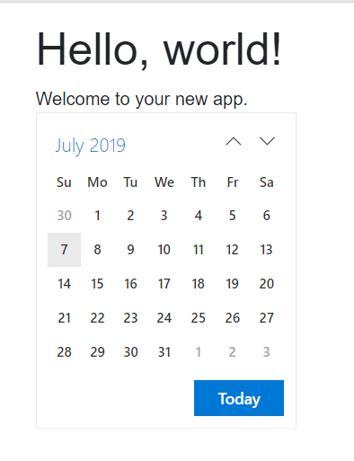

If you need professional and supported set of components for server side / client side **Blazor web applications** use Syncfusion components.

**More info:**

- [https://ej2.syncfusion.com/aspnet-core-blazor/documentation/getting-started/dotnet-cli-blazor-server/](https://ej2.syncfusion.com/aspnet-core-blazor/documentation/getting-started/dotnet-cli-blazor-server/)
- [https://ej2.syncfusion.com/aspnet-core-blazor/Grid/DefaultFunctionalities?theme=material](https://ej2.syncfusion.com/aspnet-core-blazor/Grid/DefaultFunctionalities?theme=material)

### Installation - NuGet packages :

- Syncfusion.EJ2.Blazor

#### Startup.cs

**Configure method**

Licensing is not needed in case of preview version and library don't even contain "Licensing" namespace.

// Register Syncfusion license
Syncfusion.Licensing.SyncfusionLicenseProvider.RegisterLicense("...licence string...");

#### \_Host.cshtml

@addTagHelper \*, Syncfusion.EJ2.Blazor

<head>
    <link href="https://cdn.syncfusion.com/ej2/17.2.39/bootstrap4.css" rel="stylesheet" />
    <!-- <link href="https://cdn.syncfusion.com/ej2/17.2.39/material.css" rel="stylesheet" />-->
    <!-- <link href="https://cdn.syncfusion.com/ej2/17.2.39/fabric.css" rel="stylesheet" />-->
    
    </head>

#### \_Imports.razor

@using Syncfusion.EJ2.Blazor 
@using Syncfusion.EJ2.Blazor.Calendars

#### Components usage in razor files

@page "/"
<h1>Hello, world!</h1>
Welcome to your new app.
 
<EjsCalendar></EjsCalendar>

### The result

If everything is deployed as expected you should see similar result page:

